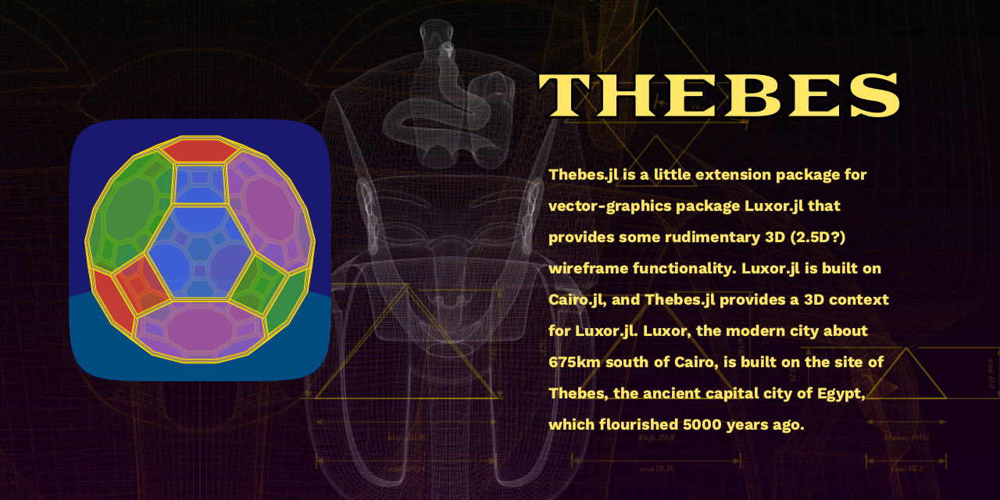

| **Documentation**                       | **Build Status**                          | **Code Coverage**               |
|:---------------------------------------:|:-----------------------------------------:|:-------------------------------:|
| [![][docs-stable-img]][docs-stable-url] | [![Build Status][travis-img]][travis-url] | [![][codecov-img]][codecov-url] |
| [![][docs-latest-img]][docs-latest-url] | [![Build Status][appvey-img]][appvey-url] |                                 |

# Thebes

Thebes.jl is a little extension for Luxor.jl that provides some rudimentary wireframe functionality.

[docs-latest-img]: https://img.shields.io/badge/docs-latest-blue.svg
[docs-latest-url]: http://cormullion.github.io/Thebes.jl/dev/

[docs-stable-img]: https://img.shields.io/badge/docs-stable-blue.svg
[docs-stable-url]: http://cormullion.github.io/Thebes.jl/stable/

[pkgeval-link]: http://pkg.julialang.org/?pkg=Thebes

[pkg-0.5-img]: http://pkg.julialang.org/badges/Thebes_0.5.svg
[pkg-0.5-url]: http://pkg.julialang.org/detail/Thebes.html

[pkg-0.6-img]: http://pkg.julialang.org/badges/Thebes_0.6.svg
[pkg-0.6-url]: http://pkg.julialang.org/detail/Thebes.html

[pkg-0.7-img]: http://pkg.julialang.org/badges/Thebes_0.7.svg
[pkg-0.7-url]: http://pkg.julialang.org/?pkg=Thebes&ver=0.7

[travis-img]: https://travis-ci.org/cormullion/Thebes.jl.svg?branch=master
[travis-url]: https://travis-ci.org/cormullion/Thebes.jl

[appvey-img]: https://ci.appveyor.com/api/projects/status/jfa9e54lv92rqd3m?svg=true
[appvey-url]: https://ci.appveyor.com/project/cormullion/thebes-jl/branch/master

[codecov-img]: https://codecov.io/gh/cormullion/Thebes.jl/branch/master/graph/badge.svg
[codecov-url]: https://codecov.io/gh/cormullion/Thebes.jl
