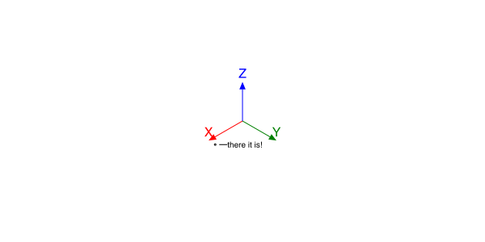
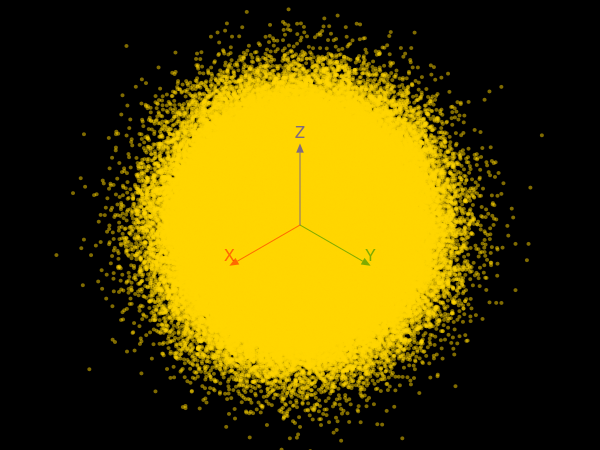
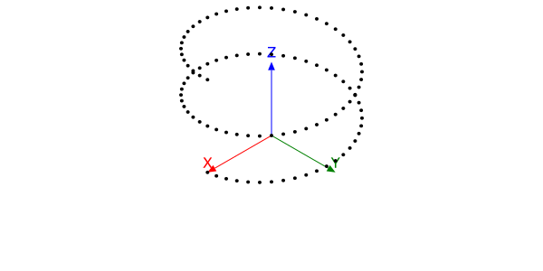
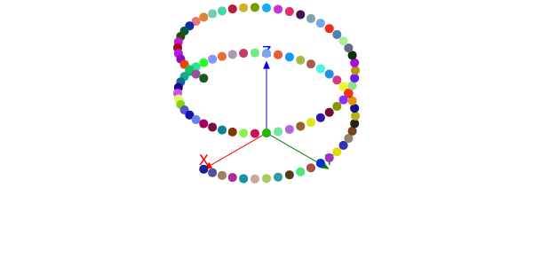
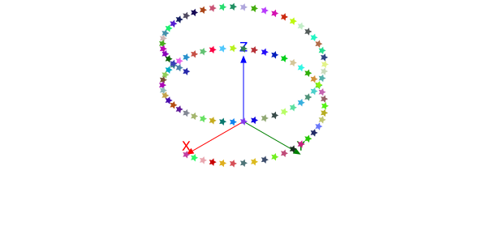
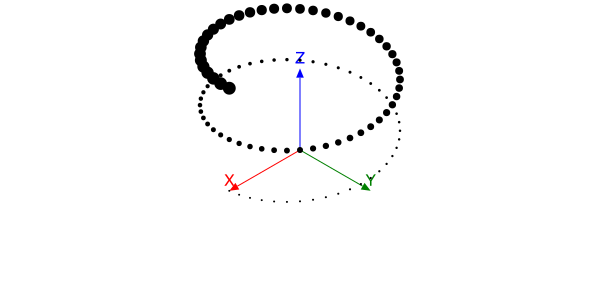
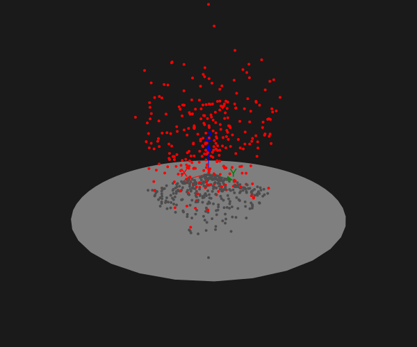
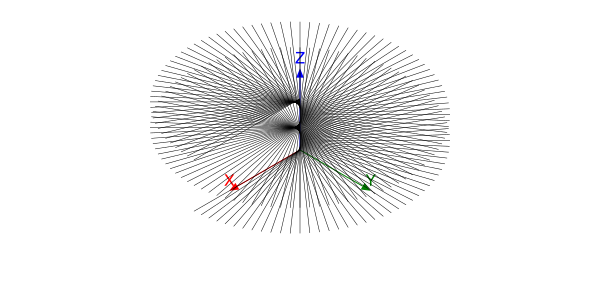
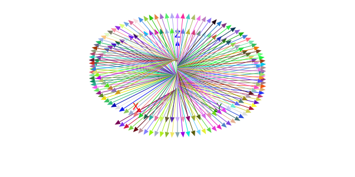

```@meta
DocTestSetup = quote
    using Thebes, Luxor, Colors
    end
```

# The basics

Thebes.jl is a small package that adds some simple 3D features to Luxor.jl.

!!! warning

    Remember: Thebes.jl is intended for simple wireframe constructions in 3D. Don't expect a comprehensive range of 3D modelling and rendering tools. Use Makie.jl (or Blender)!

The 3D world of Thebes is superimposed on the 2D world of Luxor:

```
using Thebes, Luxor

@draw begin
    rulers() # a Luxor function
    axes3D() # a Thebes function
end
```


There are two main things you have to know in order to draw in 3D:

- the `Point3D` type specifies the x, y, and z coordinates of a point in 3D space.

- there's a function called `pin()` that draws 2D graphics on the Luxor drawing at the position corresponding to the 3D point.

!!! note

    The `pin()` function sort of “pins” a 3D coordinate onto the 2D flat drawing surface. If I think of a better name for this function, I might change it, but I wanted to avoid everything obvious, like “draw”, “render”, “display”, “plot”, and have something short and easy to type.


## A simple example

Here's a complete example showing Thebes and Luxor working together:

```@example
using Thebes, Luxor
Drawing(600, 300, "assets/figures/simpleexample.svg") # a drawing is required
background("white")      # Luxor
origin()                 # Luxor
setline(1)               # Luxor
axes3D()                 # Thebes

p1 = Point3D(100, 20, 0) # Thebes

loc = pin(p1)            # Thebes  

label("there it is!", :e, loc + (5, 0), offset=10, leader=true)  # Luxor

finish()                 # Luxor

nothing # hide
```



!!! tip

    Because Thebes.jl displays 3D points on the current 2D Luxor drawing, you should always have a current drawing before using most of the functions from Thebes.

### Point cloud

We can do lots of points - here's half a million or so.

```@example
using Thebes, Luxor # hide
Drawing(600, 450, "assets/figures/pointcloud.png") #hide
helloworld() # hide
origin() # hide
background("black")
setopacity(0.5)
sethue("gold")
c = pin.([Point3D(randn() * 50, randn() * 50, randn() * 50)
    for x in 1:75, y in 1:75, z in 1:75])
axes3D()
finish() # hide
nothing # hide
length(c)
```



## Helical dots

Let's draw a helix made of dots:

```@example
using Thebes, Luxor # hide
Drawing(600, 300, "assets/figures/helix1.svg") #hide
background("white") # hide
origin() # hide
helloworld() # hide
axes3D()

helix = [Point3D(100cos(θ), 100sin(θ), 10θ) for θ in 0:π/24:4π]

pin.(helix)

finish() # hide
nothing # hide
```



## gfunctions

The default graphical rendition of a 3D point is pretty basic: a circle. But you can modify the graphics drawn at each location by passing a function to the `pin()` function's optional keyword argument, `gfunction` .

Suppose you want to draw a randomly colored circle at the location of each 3D point, with radius 5 units.

```@example
using Thebes, Luxor # hide
Drawing(600, 300, "assets/figures/helix2.svg") #hide
background("white") # hide
origin() # hide
axes3D()

helix = [Point3D(100cos(θ), 100sin(θ), 10θ) for θ in 0:π/24:4π]

pin.(helix, gfunction = (_, pt) -> begin
    randomhue()
    circle(pt, 5, :fill)
    end)

finish()
nothing # hide
```



The anonymous function passed to `gfunction` expects two arguments: the first contains the 3D point, the second contains the 2D point. The function then has the responsibility to draw the 2D graphics for that 2D point, with the possibility of using anything or nothing about the original 3D coordinates. This gives us more control over the rendering of the points.

If you just want simple Luxor stars, you use the second (2D) argument - you don't need the first (3D) one, and we can use the convention of having `_` to signify that.

```@example
using Thebes, Luxor # hide
Drawing(600, 300, "assets/figures/helix2stars.svg") #hide
background("white") # hide
origin() # hide
axes3D()

helix = [Point3D(100cos(θ), 100sin(θ), 10θ) for θ in 0:π/24:4π]

pin.(helix, gfunction = (_, pt) -> begin
    randomhue()
    star(pt, 5, 5, 0.5, 0.0, :fill)
    end)

finish() # hide
nothing # hide
```



In this next example, the gfunction calculates the distance of the 3D point from the 3D origin, and then draws the 2D circle with a 2D radius that reflects the distance. The function therefore requires both the original 3D point (in the first argument `p3`) and the second argument (in `p2`), its 2D projection.

```@example
using Thebes, Luxor # hide
Drawing(600, 300, "assets/figures/helix3.svg") #hide
background("white") # hide
origin() # hide
axes3D(100)

helix = [Point3D(100cos(θ), 100sin(θ), 10θ) for θ in 0:π/24:4π]

pin.(helix, gfunction = (p3, p2) -> begin
    d = rescale(distance(p3, Point3D(0, 0, 0)), 100, 200, 1, 10)
    circle(p2, d, :fill)
    end)


finish() # hide
nothing # hide
```



!!! note

    Remember that all the graphics drawn are 2D graphics. This isn't real 3D, remember! The human brain is quite adaptable, though.

In the next example, each random 3D point is drawn twice, the second time with a zero z coordinate, to make shadows.

```
using Thebes, Luxor # hide

Drawing(600, 500,  "assets/figures/points-shadows.svg") # hide
origin() # hide
background("grey10") # hide
eyepoint(Point3D(250, 250, 100)) # hide
sethue("grey50") # hide
carpet(300)
axes3D(100)
sethue("red")
for i in 1:300
    randpoint3D = Point3D(rand(0.0:200, 3)...)
    sethue("red")
    pin(randpoint3D,
        gfunction = (_, p2) -> circle(p2, 2, :fill))
    sethue("grey30")
    pin(Point3D(randpoint3D.x, randpoint3D.y, 0),
        gfunction = (_, p2) -> circle(p2, 2, :fill))
end
finish() # hide
nothing # hide
```



## Lines

Dots are all very well, but suppose we wanted to draw lines? `pin()` also accepts two 3D points.

This code uses the same 3D points in the helix, but this time draws a line from each projected 2D point to the projection of the nearest point on the vertical z axis.

```@example
using Thebes, Luxor # hide
Drawing(600, 300, "assets/figures/helix4.svg") #hide
background("white") # hide
origin() # hide
axes3D()

helix = [Point3D(150cos(θ), 150sin(θ), 5θ) for θ in 0:π/48:4π]

setline(0.5)

for p in helix
    pin(p, Point3D(0, 0, p.z))
end

finish() # hide
nothing # hide
```



The default gfunction's arguments consist of two pairs of points (a pair of 3D points, and a pair of 2D points), not just two of each, and Luxor's trusty old `line()` function is the default action, connecting the 2D pair.

Or we could provide a custom gfunction to draw multicoloured arrows instead:

```@example
using Thebes, Luxor # hide
Drawing(600, 300, "assets/figures/helix5.svg") #hide
background("white") # hide
origin() # hide
axes3D()

helix = [Point3D(150cos(θ), 150sin(θ), 5θ) for θ in 0:π/48:4π]

setline(0.5)

for p in helix
    pin(p, Point3D(0, 0, p.z), gfunction = (p3p, p2p) ->
        begin
            randomhue()
            arrow(last(p2p), first(p2p))
        end)
end

finish() # hide
nothing # hide
```



# When things go wrong

In 2D graphics, things sometimes go wrong when values get close to zero or infinity. The same thing is true for 3D too, when the coordinates start stressing out the projecting equations. Really good 3D software will prevent this happening. In Thebes, though, you may occasionally see glitches. You're only seeing half the "world" that's in front of you  - there's nearly a whole half-world falling behind the eye position, and this means that some points don't get drawn succesfully.

In general, if the `pin()` function can't display points or lines, it will probably just discard them and carry on, rather than attempt to draw things in impossible locations or straight lines that curve in space. So if you notice parts of your drawing missing, the easiest thing to do is to move the eyepoint further away from the 3D points in question.

## Conversions

The `convert()` function provides a useful way to convert 2D coordinates to 3D. If you can generate your graphics in 2D, you can convert them to 3D, and then use `pin()` to project them back into two dimensions.

This example shows how to draw the familiar Julia coloured circles. We can't use real circles (because there are no Bézier paths in Thebes yet), so we use `ngon()` with plenty of sides - 60 is probably good enough if your output is high-quality SVG.

```@example
using Thebes, Luxor # hide

function juliadots3D(origin::Point3D, rotation=(0, 0, 0);
        radius=100)
    threedots = Array{Point3D, 1}[]
    points = ngon(O, radius, 3, -π/3, vertices=true) #
    @layer begin
        for (n, p) in enumerate(points)
            # zcoordinate defaults to 0 in convert()
            push!(threedots, origin .+ convert.(Point3D, ngon(p, 0.75 * radius, 60)))
        end
        for (n, dot) in enumerate(threedots)
            sethue([Luxor.julia_purple, Luxor.julia_green, Luxor.julia_red][mod1(n, end)])
            # rotate about an arbitrary point (first pt of green dot will do for now)
            d1 = rotateby.(dot, threedots[2][1], rotation...)
            pin(d1, gfunction = (_, pts) -> poly(pts, close=true, :fill))
        end
    end
end

function juliaroom()
    Drawing(500, 500, "assets/figures/juliaroom.svg")
    origin()
    background("black")
    helloworld()
    eyepoint(1200, 1200, 1200)
    perspective(800)
    for x in 30:50:500
        for y in 30:50:500
                juliadots3D(Point3D(x, y, 0), (0, 0, 0), radius=12)
        end
    end
    for x in 30:50:500
        for z in 30:50:500
                juliadots3D(Point3D(x, 0, z), (π/2, π/2, 0), radius=12)
        end
    end
    for y in 30:50:500
        for z in 30:50:500
                juliadots3D(Point3D(0, y, z), (0, π/2, -π), radius=12)
        end
    end

    axes3D(300)
    finish()
end

juliaroom()
nothing # hide
```


You could zoom in to see if you can see the straight edges of the circles - I think 60 points is good enough.
