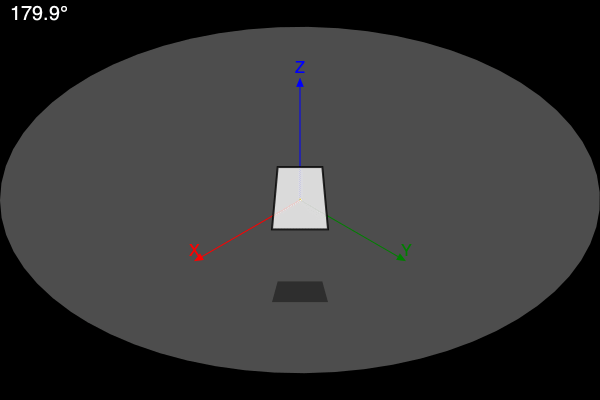
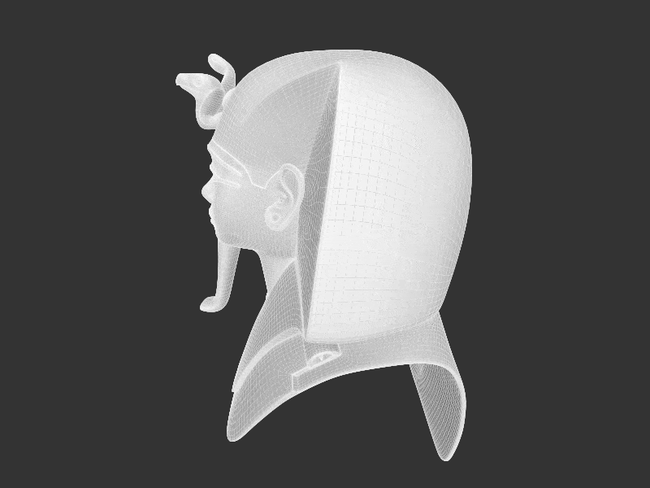

```@meta
DocTestSetup = quote
    using Thebes, Luxor, Colors, Rotations
    end
```

# Objects

So far we’ve been drawing individual points, lines, and polygons. `pin()` has been projecting them all onto the current drawing. 

You can also draw an `object`. This lets us complete the pin-table:

|         | `pin()` arguments               | the gfunction arguments                                      |
|---------|---------------------------------|----------------------------------------------------------|
| point   | `pin(p1::Point3D)`              | `(p3::Point3D, p2::Point)`                                 |
| line    | `pin(p1::Point3D, p2::Point3D)` | `((p31::Point3D, p32::Point3D), (p21::Point, p22::Point))` |
| polygon |` pin(a::Vector{Point3D})`       | `(a1::Vector{Point3D}, a2::Vector{Point})`                 |
| object  | `pin(o::Object)`                | `(o::Object)`                                              |

An object is a collection of 3D points and a list of faces - which vertices are joined to form a face.

## Making objects with `make`

You can make a 3D object using `make()`, and then use `pin()` to project it onto the 2D drawing.

`make()` expects an array of 3D points, an (optional) array of face definitions, and an (optional) array of labels, plus an (optional) name. These arrays let you link faces with vertices. It returns an Object.

Information about cubes is already defined in Thebes (we needn't have made one earlier, really) as `Cube`, a tuple of Point3Ds and face definitions. You can make a cube object from this data with:

```
cube = make(Cube, "cube")
```

Now the `cube` variable contains:

```
Object(
    Point3D[
        Point3D(-0.5, 0.5, -0.5),
        Point3D(0.5, 0.5, -0.5),
        Point3D(0.5, -0.5, -0.5),
        Point3D(-0.5, -0.5, -0.5),
        Point3D(-0.5, 0.5, 0.5),
        Point3D(0.5, 0.5, 0.5),
        Point3D(0.5, -0.5, 0.5),
        Point3D(-0.5, -0.5, 0.5)
    ],

    [[1, 2, 3, 4],
     [2, 6, 7, 3],
     [6, 5, 8, 7],
     [5, 1, 4, 8],
     [1, 5, 6, 2],
     [4, 3, 7, 8]],

     [1, 2, 3, 4, 5, 6],

     "cube")
```

There are 8 3D points. And there are 6 faces defined. Face 1 is formed by vertices 1, 2, 3, and 4, face 2 is formed by vertices 2, 6, 7, and 3, and so on.
The default rendering applied by `pin()` is an attempt at a simple hidden-surface display. 

```@example
using Thebes, Luxor # hide
@drawsvg begin
background("grey20") # hide
helloworld() # hide
eyepoint(2, 2, 2)
perspective(500)
cube = make(Cube, "cube")
pin(cube)

end 800 400
```

!!! note
    
    In real 3D software such as Makie.jl, the rendering is much more sophisticated!

The default gfunction for this method of `pin` is `hiddensurface`, which is built in to Thebes as `Thebes.hiddensurface(o::Object)`. 
We could call:

```julia
    pin(cube, gfunction = hiddensurface)
```

to specify the rendering function explicitly.

Another built-in gfunction is `wireframe()`:

```@example
using Thebes, Luxor # hide
@drawsvg begin
    background("grey20") # hide
    helloworld() # hide
    eyepoint(2, 2, 2)
    perspective(500)
    sethue("gold")
    cube = make(Cube, "cube")
    pin(cube, gfunction = wireframe)
end 800 400
```

## Making objects directly 

Here's a very simple example of how you might make your own object from scratch. We'll make a heptagonal pyramid, setting N to 7.

```@example
using Thebes, Luxor # hide
@drawsvg begin
background("grey20") # hide
setlinejoin("bevel")
helloworld() # hide
carpet(200)
vertices = Point3D[]
N = 7
polygon = ngon(O, 150, N, vertices=true)

for i in eachindex(polygon)
    push!(vertices, convert(Point3D, polygon[i]))
end

# add the tip
push!(vertices, Point3D(0, 0, 200))

faces = Vector{Int64}[]

for i in eachindex(polygon)
    push!(faces, [i, mod1(i + 1, N), N + 1])
end

obj = make([vertices, faces], "")
setopacity(0.8)
pin(obj, gfunction = hiddensurface)
end 800 600
```

First we pushed the vertices into an array, then added the top vertex as the `N + 1`th. The `faces` array is filled with lists such as `[1, 2, N]`, `[2, 3, N]` to make the sides. Finally the `make()` function takes the vertices and faces and returns an Object.

The pyramid doesn't have a base. To add one, add the line:

```julia
push!(faces, 1:N)
```

just before the `make()` function builds the object.

## Using objects

Thebes has a few 3D coordinate sets pre-defined that you can use with `make()`:

```@example
using Thebes, Luxor, Colors # hide

@drawsvg begin
background("grey20") # hide
setlinejoin("bevel")
helloworld() # hide
perspective(250)
eyepoint(2, 2, 2)

setopacity(0.8)

pts = between.(boxmiddleleft(), boxmiddleright(), range(0.1, 0.9, length=4))
for (n, o) in enumerate((Cube, Pyramid, Tetrahedron, Teapot))
    @layer begin
        translate(pts[n])
        pin(make(o))
    end
end
end 800 300
```

These are automatically imported (from `data/objects.jl`) when Thebes.jl starts:

- Cube
- Tetrahedron
- Pyramid
- Teapot

The teapot is a thing, apparently.

```@example
using Thebes, Luxor # hide
@drawsvg begin
    background("grey20") # hide
    helloworld() # hide
    perspective(500)
    eyepoint(200, 200, 150)
    carpet(200)
    axes3D()
    teapot = make(Teapot)
    setline(0.5)
    sethue("white")
    scaleby!(teapot, 100, 100, 100)
    pin(teapot, gfunction=hiddensurface)
end 800 400
```

You can load more objects by including the `moreobjects.jl` file from the `data` folder:

```
include(dirname(dirname(pathof(Thebes))) * "/data/moreobjects.jl")
```

which brings these objects into play:

`boxcube` `boxtorus` `concave` `cone` `crossshape` `cube` `cuboctahedron` `dodecahedron` `geodesic` `helix2` `icosahedron` `icosidodecahedron` `octahedron` `octtorus` `rhombicosidodecahedron` `rhombicuboctahedron` `rhombitruncated_cubeoctahedron` `rhombitruncated_icosidodecahedron` `snub_cube` `snub_dodecahedron` `sphere2` `tet3d` `tetrahedron` `triangle` `truncated_cube` `truncated_dodecahedron` `truncated_icosahedron` `truncated_octahedron` `truncated_tetrahedron`

## Rendering objects

!!! note

    Rendering objects realistically is not something that Thebes really bothers with - there are many better options for this task. 

There are many choices you can make about how to draw the faces and the vertices of an object.

### Using gfunctions

The gfunction for `pin` can be used to choose a rendering style for an object.

Here's a simple example:

```@example
using Thebes, Luxor # hide

function mygfunction(o::Object)
    sortfaces!(o)
    if !isempty(o.faces)
        @layer begin
            for (n, face) in enumerate(o.faces)
                @layer begin
                    vertices = o.vertices[face]
                    sn = surfacenormal(vertices)
                    ang = anglebetweenvectors(sn, eyepoint())
                    setgrey(rescale(ang, 0, π, 0, 1))
                    pin(vertices, gfunction=(p3, p2) -> poly(p2, :fill))
                end
            end
        end
    end
end

include(dirname(pathof(Thebes)) * "/../data/moreobjects.jl")

object = make(geodesic, "geodesic")

@draw begin
    background("grey20") # hide
    helloworld() # hide
    setlinejoin("bevel")
    eyepoint(200, 200, 200)
    pin(scaleby!(object, 300, 300, 300), gfunction=mygfunction)
end 800 800
```

`pin` here calls `mygfunction(o)` to render object `o`. First, the `sortfaces()` function sorts the faces in `o` so that the ones that are furthest from the eyepoint are drawn first. Then the surface normal of each face is calculated, and the angle between the surface normal and a line to the eyepoint determines the color of the face. 

The surface normal is an imaginary line that meets the face at right angles, and indicates the direction of that face. If you measure the distance between the surface normal and the direction of, say, the direction of a line from the origin to the eyepoint, you can obtain a value that indicates the orientation of the face. You can then use this to control the rendering: an angle approaching π suggests that the facet is almost facing the viewer, and you can color it accordingly.



## Using custom code

Thebes.jl is a toy rather than a full 3D renderer, and a general-purpose rendering function that draws everything with lots of optional parameters is not provided. There are plenty of ways to experiment:

```@example
using Luxor, Thebes, Colors, ColorSchemes

include(dirname(pathof(Thebes)) * "/../data/moreobjects.jl")

function lighten(col::Colorant, f)
    c = convert(RGB, col)
    return RGB(f * c.r, f* c.g, f * c.b)
end

function drawobject(o;
        color=colorant"red")
    setlinejoin("bevel")
    if !isempty(o.faces)
        @layer begin
            for (n, f) in enumerate(o.faces)
                vs = o.vertices[f]
                sn = surfacenormal(vs)
                ang = anglebetweenvectors(sn, eyepoint())
                sl = slope(O, vs[1])
                sethue(lighten(color, rescale(ang, 0, π, -2, 2)))
                pin(vs, gfunction = (p3, p2) -> begin
                    poly(p2, :fill)
                    sethue("grey30")
                    poly(p2, :stroke)
                end)
            end
        end
    end
end

function sphere(size, origin, color)
    s1 = make(sphere2)
    scaleby!(s1, size, size, size)
    moveby!(s1, origin)
    sortfaces!(s1)
    drawobject(s1, color=color)
end

function main()
    @drawsvg begin
    background("grey20")
    helloworld()
    eyepoint(300, 300, 300)
    perspective(450)
    setline(.5)
    sphere(90, Point3D(150, 0, 0), RGB(Luxor.julia_red...))
    sphere(90, Point3D(0, 150, 0), RGB(Luxor.julia_purple...))
    sphere(90, Point3D(0, 0, 150), RGB(Luxor.julia_green...))
    end 800 600
end

main()
```

!!! note
   
   There are easier ways...

## OFF the shelf objects

There are many formats for exchanging 3D data between software applications. Thebes.jl knows about one of these formats, the [Object File Format (.OFF)](https://en.wikipedia.org/wiki/OFF_(file_format)). You'll find a few objects already made for you to use directly.

Here's what a typical OFF file, "cube.off", looks like:

```plain
OFF
8 6 0
-0.500000 -0.500000 0.500000
0.500000 -0.500000 0.500000
-0.500000 0.500000 0.500000
0.500000 0.500000 0.500000
-0.500000 0.500000 -0.500000
0.500000 0.500000 -0.500000
-0.500000 -0.500000 -0.500000
0.500000 -0.500000 -0.500000
4 0 1 3 2
4 2 3 5 4
4 4 5 7 6
4 6 7 1 0
4 1 7 5 3
4 6 0 2 4
```

The file contains 8 3D points, defined as three numbers, followed by the definitions of 6 faces. The first face `4 0 1 3 2` has 4 vertices, and joins vertices 0 (on line 3), 1, 3, and 2.

To load the contents of the OFF file into an object, use `import_off_file()`.

Here's an example that loads an OFF file of the mask of Tutenkhamun (whicn can be found in the Thebes `data` directory) and rotates it.

```julia
using Thebes, Luxor # hide

function frame(scene, framenumber, o)
    eased_n = rescale(scene.easingfunction(framenumber, 0, 1,
            scene.framerange.stop), 0, 1, 0, 2π)
    helloworld()
    perspective(300)
    eyepoint(200cos(eased_n), 200sin(eased_n), 80)
    background("grey20")
    setlinejoin("bevel")
    setline(0.2)
    pin(o)
end

function main()
    scaleby!(o, 15)
    moveby!(o, 0, 0, -150)
    amovie = Movie(800, 600, "tut")
    animate(amovie,
        Scene(amovie, (s, f) -> frame(s, f, o), 1:100),
        framerate=15,
        creategif=true)
end

f = dirname(dirname(pathof(Thebes))) * "/data/tut.off"
o = make(import_off_file(f))
main()
```


