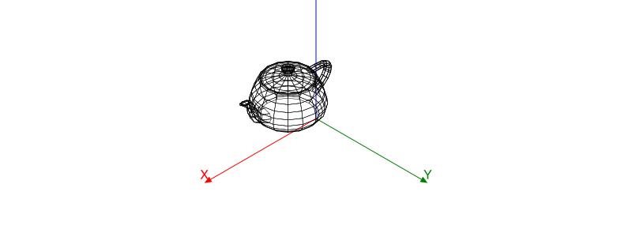
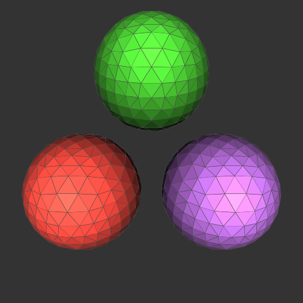

```@meta
DocTestSetup = quote
    using Thebes, Luxor, Colors, Rotations
    end
```

# Objects

So far we've been drawing individual points and lines. This gets tiresome when you have a lot of them. Fortunately, Thebes has a few features for handling larger groups of points.

## Making objects

You make a 3D object using `make()`, and then use `pin()` to throw it onto the 2D drawing.

`make()` expects an array of 3D points, an (optional) array of face definitions, and an (optional) array of labels, plus an (optional) name. These arrays let you link faces with vertices. It returns an Object.

A Cube object is already defined in Thebes (we needn't have made one earlier, really). So after:

```
cube = make(Cube, "cube")
```

the `cube` variable contains:

```
Object(
    Point3D[
        Point3D(-0.5, 0.5, -0.5),
        Point3D(0.5, 0.5, -0.5),
        Point3D(0.5, -0.5, -0.5),
        Point3D(-0.5, -0.5, -0.5),
        Point3D(-0.5, 0.5, 0.5),
        Point3D(0.5, 0.5, 0.5),
        Point3D(0.5, -0.5, 0.5),
        Point3D(-0.5, -0.5, 0.5)
    ],

    [[1, 2, 3, 4],
     [2, 6, 7, 3],
     [6, 5, 8, 7],
     [5, 1, 4, 8],
     [1, 5, 6, 2],
     [4, 3, 7, 8]],

     [1, 2, 3, 4, 5, 6],

     "cube")
```

The default rendering applied by `pin()` is an attempt at a simple hidden-surface display. In real 3D software, this process has to be far more sophisticated.

```@example
using Thebes, Luxor # hide
Drawing(600, 300, "assets/figures/simplecubeobject.svg") # hide
background("white") # hide
origin() # hide
helloworld() # hide

eyepoint(10, 10, 10)
perspective(3000)
cube = make(Cube, "cube")
pin(cube)

finish() # hide
nothing # hide
```


Here's a very simple example of how you might make your own object from scratch.

```@example
using Thebes, Luxor # hide
Drawing(600, 300, "assets/figures/object1.svg") # hide
background("white") # hide
origin() # hide
helloworld() # hide

tol = 0.001
a = Point3D[]
for t in -2pi:tol:2pi
    push!(a, Point3D((100 + cos(5t)) * cos(3t), (100 + cos(5t)) * sin(2t), sin(5t)))
end
sethue("darkorange")
knot = make([a, []], "knot")

pin(knot, gfunction = (o) -> poly(objecttopoly(o)[1], :stroke))

finish() # hide
nothing # hide
```


The `objecttopoly()` function returns a tuple, containing the 2D vertices, and the polygons that define the faces.

## Using objects

The following objects are preloaded (from `data/objects.jl`) when Thebes.jl starts:

- Cube
- Tetrahedron
- Pyramid
- Teapot

```@example
using Thebes, Luxor # hide
Drawing(800, 300, "assets/figures/moreobjects.svg") # hide
background("white") # hide
origin() # hide
sethue("blue") # hide
helloworld() # hide

t = Tiler(600, 300, 2, 2)
setline(0.5)
for (n, o) in enumerate([Cube, Tetrahedron, Pyramid, Teapot])
    @layer begin
        translate(first.(t)[n])
        object = make(o, string(o))
        scaleby!(object, 80, 80, 80)
        pin(object)
    end
end

finish() # hide
nothing # hide
```


```@example
using Thebes, Luxor # hide
Drawing(800, 300, "assets/figures/teapot.svg") # hide
background("white") # hide
origin() # hide
helloworld()
axes3D(200)
teapot = make(Teapot)
setline(0.5)
scaleby!(teapot, 100, 100, 100)
pin(teapot, gfunction=wireframe)
finish() # hide
nothing # hide

```



You can load a few more objects by including the `moreobjects.jl` file:

```
include(dirname(dirname(pathof(Thebes))) * "/data/moreobjects.jl")
```

which brings these objects into play:

`boxcube` `boxtorus` `concave` `cone` `crossshape` `cube` `cuboctahedron` `dodecahedron` `geodesic` `helix2` `icosahedron` `icosidodecahedron` `octahedron` `octtorus` `rhombicosidodecahedron` `rhombicuboctahedron` `rhombitruncated_cubeoctahedron` `rhombitruncated_icosidodecahedron` `snub_cube` `snub_dodecahedron` `sphere2` `tet3d` `tetrahedron` `triangle` `truncated_cube` `truncated_dodecahedron` `truncated_icosahedron` `truncated_octahedron` `truncated_tetrahedron`

## Rendering objects

To render objects, there are many choices you can make about how to draw the faces and the vertices.

### Using gfunctions

You do this with a gfunction.

Here's a simple example:

```@example
using Thebes, Luxor # hide

include(dirname(pathof(Thebes)) * "/../data/moreobjects.jl")

Drawing(600, 600, "assets/figures/geodesic.svg") # hide
background("white") # hide
origin() # hide
sethue("blue") # hide
helloworld() # hide
setlinejoin("bevel")
eyepoint(150, 150, 150)

function mygfunction(o::Object)
    cols = [Luxor.julia_green, Luxor.julia_red, Luxor.julia_purple, Luxor.julia_blue]
    sortfaces!(o)
    if !isempty(o.faces)
        @layer begin
            for (n, face) in enumerate(o.faces)
                @layer begin
                    vertices = o.vertices[face]
                    sn = surfacenormal(vertices)
                    ang = anglebetweenvectors(sn, eyepoint())
                    sethue(cols[mod1(n, end)])
                    pin(vertices, gfunction = (p3, p2) ->
                        begin
                            poly(p2, :fill)
                            sethue("gold")
                            poly(p2, :stroke, close=true)
                        end)
                end
            end
        end
    end
    setcolor("gold3")
    pin.(o.vertices, gfunction = (p3, p2) -> begin
        setopacity(1)
        circle(p2, 2, :fill)
        end)
end

object = make(geodesic, "geodesic")
setopacity(0.9)
setline(0.5)
pin(scaleby!(object, 200, 200, 200), gfunction = mygfunction)

finish() # hide
nothing # hide
```


## Faces

The faces are drawn in the order in which they were defined. But to be a more realistic 3D drawing, the faces should be drawn so that the ones nearest the viewer are drawn last, or better still, so that the ones that can't be seen aren't drawn at all.

!!! note

    This is why Thebes is more of a wireframe tool than any kind of genuine 3D application. Use Makie.jl. Or program Blender with Julia.

In theory it's possible to do some quick calculations on an object to sort the faces into the correct order for a particular viewpoint. The `sortfaces!()` function used above can do this for simple objects - it may be sufficient.

## Using custom code

Thebes.jl is a work in progress, and a good general-purpose rendering function that draws everything with lots of optional parameters is not yet provided. However, you can avoid using the built-in `pin(o::Object)` function, and experiment with code such as the following:

```@example
using Luxor, Thebes, Colors, ColorSchemes

include(dirname(pathof(Thebes)) * "/../data/moreobjects.jl")

function lighten(col::Colorant, f)
    c = convert(RGB, col)
    return RGB(f * c.r, f* c.g, f * c.b)
end

function drawobject(o;
        color=colorant"red")
    setlinejoin("bevel")
    if !isempty(o.faces)
        @layer begin
            for (n, f) in enumerate(o.faces)
                vs = o.vertices[f]
                sn = surfacenormal(vs)
                ang = anglebetweenvectors(sn, eyepoint())
                sl = slope(O, vs[1])
                sethue(lighten(color, rescale(ang, 0, π, -2, 2)))
                pin(vs, gfunction = (p3, p2) -> begin
                    poly(p2, :fill)
                    sethue("grey30")
                    poly(p2, :stroke)
                end)
            end
        end
    end
end

function sphere(size, origin, color)
    s1 = make(sphere2)
    scaleby!(s1, size, size, size)
    moveby!(s1, origin)
    sortfaces!(s1)
    drawobject(s1, color=color)
end

function main()
    Drawing(500, 500, "assets/figures/juliaspheres.svg")
    background("grey20")
    origin()
    helloworld()
    eyepoint(300, 300, 300)
    perspective(450)
    setline(.5)
    sphere(90, Point3D(150, 0, 0), RGB(Luxor.julia_red...))
    sphere(90, Point3D(0, 150, 0), RGB(Luxor.julia_purple...))
    sphere(90, Point3D(0, 0, 150), RGB(Luxor.julia_green...))
    finish()
end

main()
nothing # hide
```



This code uses the surface normal of each rectangular facet to change the color. The surface normal is an imaginary line that meets the facet at right angles, and indicates the direction of that facet. If you measure the distance between the surface normal and the direction of, say, the direction of a line from the origin to the eyepoint, you can obtain a value that indicates the orientation of the facet. You can then use this, as here, to change the color: an angle approaching π suggests that the facet is almost facing the viewer, and you can color it accordingly.


!!! note

   It's hard work doing it all like this! There are easier ways...

## OFF the shelf objects

There are many formats for exchanging 3D data between software applications. Thebes.jl knows about one of these formats, the [Object File Format (.OFF)](https://en.wikipedia.org/wiki/OFF_(file_format)). You'll find a few objects already made for you to use directly.

Here's what a typical OFF file, "cube.off", looks like:

```plain
OFF
8 6 0
-0.500000 -0.500000 0.500000
0.500000 -0.500000 0.500000
-0.500000 0.500000 0.500000
0.500000 0.500000 0.500000
-0.500000 0.500000 -0.500000
0.500000 0.500000 -0.500000
-0.500000 -0.500000 -0.500000
0.500000 -0.500000 -0.500000
4 0 1 3 2
4 2 3 5 4
4 4 5 7 6
4 6 7 1 0
4 1 7 5 3
4 6 0 2 4
```

The file contains 8 3D points, defined as three numbers, followed by the definitions of 6 faces. The first face `4 0 1 3 2` has 4 vertices, and joins vertices 0 (on line 3), 1, 3, and 2.

To load the contents of the OFF file into an object, use `import_off_file()`.

Here's an example that loads an OFF file of the mask of Tutenkhamun (from the `data` directory) and rotates it.

```julia
using Luxor
using Thebes

function frame(scene, framenumber, o)
    eased_n = rescale(scene.easingfunction(framenumber, 0, 1,
    scene.framerange.stop), 0, 1, 0, 2π)
    perspective(200)
    eyepoint(200cos(eased_n), 200sin(eased_n), 80)
    background("black")
    setlinejoin("bevel")
    sethue("gold")
    setline(0.4)   
    pin(o)
end

function main()
    scaleby!(o, 15)
    moveby!(o, 0, 0, -150)
    amovie = Movie(600, 600, "tut")
    animate(amovie,
        Scene(amovie, (s, f) -> frame(s, f, o), 1:50),
        framerate=15,
        creategif=true)
end

f = dirname(dirname(pathof(Thebes))) * "/data/tut.off"
o = make(import_off_file(f))
main()
```


