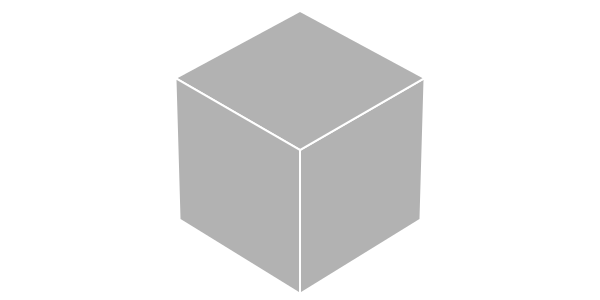
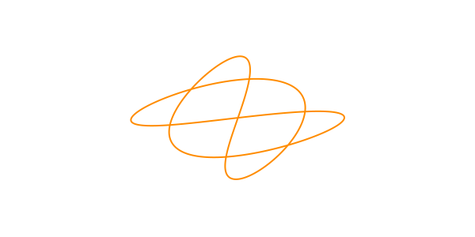
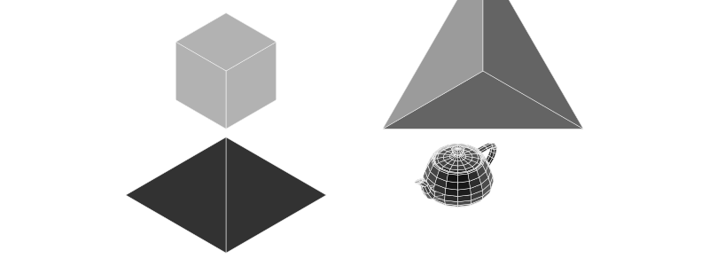
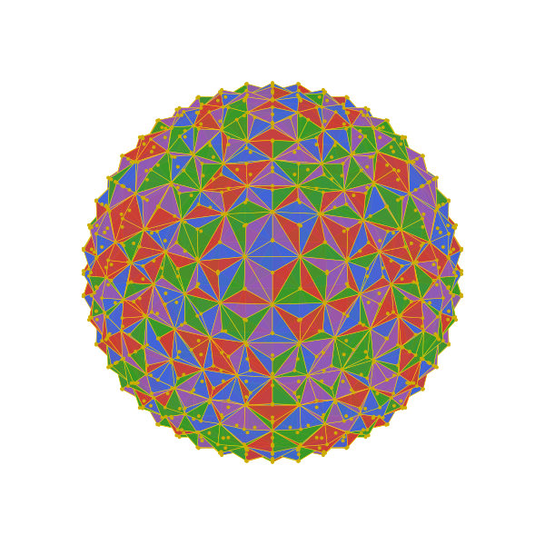

```@meta
DocTestSetup = quote
    using Thebes, Luxor, Colors
    end
```

# Objects

So far we've been drawing individual points and lines. This gets tiresome when you have a lot of them. Fortunately, Thebes has a few features for handling larger groups of points.

## Making objects

You make an 3D object using `make()`, and then use `pin()` to throw it at the 2D canvas.

`make()` expects an array of 3D points, an (optional) array of face definitions, and an (optional) array of labels, plus an (optional) name. These arrays let you link faces with vertices. It returns an Object.

A Cube object is already defined in Thebes (we needn't have made one, really). So after:

```
cube = make(Cube, "cube")
```

you'll get:

```
Object(
    Point3D[
        Point3D(-0.5, 0.5, -0.5),
        Point3D(0.5, 0.5, -0.5),
        Point3D(0.5, -0.5, -0.5),
        Point3D(-0.5, -0.5, -0.5),
        Point3D(-0.5, 0.5, 0.5),
        Point3D(0.5, 0.5, 0.5),
        Point3D(0.5, -0.5, 0.5),
        Point3D(-0.5, -0.5, 0.5)
    ],

    [[1, 2, 3, 4],
     [2, 6, 7, 3],
     [6, 5, 8, 7],
     [5, 1, 4, 8],
     [1, 5, 6, 2],
     [4, 3, 7, 8]],

     [1, 2, 3, 4, 5, 6],

     "cube")
```

The default rendering applied by `pin()` uses less than fifty shades of grey.

```@example
using Thebes, Luxor # hide
Drawing(600, 300, "assets/figures/simplecubeobject.svg") # hide
background("white") # hide
origin() # hide
helloworld() # hide

eyepoint(10, 10, 10)
perspective(3000)
cube = make(Cube, "cube")
pin(cube)

finish() # hide
nothing # hide
```



Here's a very simple example of how you might make your own object from scratch.

```@example
using Thebes, Luxor # hide
Drawing(600, 300, "assets/figures/object1.svg") # hide
background("white") # hide
origin() # hide
helloworld() # hide

tol = 0.001
a = Point3D[]
for t in -2pi:tol:2pi
    push!(a, Point3D((100 + cos(5t)) * cos(3t), (100 + cos(5t)) * sin(2t), sin(5t)))
end
sethue("darkorange")
knot = make([a, []], "knot")

pin(knot, gfunction = (args...) -> poly(args[1], :stroke))

finish() # hide
nothing # hide
```



The gfunction here receives the `vertices`, `faces`, and `labels`, but the faces and labels are empty, so this simple `pin` only needs to draw a polygon through the vertices.


## OFF the shelf objects

Obviously this isn't something you'd want to do "by hand" very often. Fortunately there are plenty of people who are prepared to make 3D objects and distribute them in standard file formats, via the internet. Thebes knows about one of these formats, the .OFF file format. So there are a few objects already available for you to use directly.

## Using objects

The following objects have already been loaded (from `data/objects.jl`) when Thebes starts:

- Cube, Tetrahedron, Pyramid, Teapot

```@example
using Thebes, Luxor # hide
Drawing(800, 300, "assets/figures/moreobjects.svg") # hide
background("white") # hide
origin() # hide
sethue("blue") # hide
helloworld() # hide

t = Tiler(600, 300, 2, 2)
for (n, o) in enumerate([Cube, Tetrahedron, Pyramid, Teapot])
    @layer begin
        translate(first.(t)[n])
        object = make(o, string(o))
        setscale!(object, 50, 50, 50)
        pin(object)
    end
end

finish() # hide
nothing # hide
```

`carpet(n)` is a customizable circular carpet.



You can load a few more objects by including the `moreobjects.jl` file:

```
include("data/moreobjects.jl")
```

which brings these objects into play:

`boxcube` `boxtorus` `concave` `cone` `crossshape` `cube` `cuboctahedron` `dodecahedron` `geodesic` `helix2` `icosahedron` `icosidodecahedron` `octahedron` `octtorus` `rhombicosidodecahedron` `rhombicuboctahedron` `rhombitruncated_cubeoctahedron` `rhombitruncated_icosidodecahedron` `snub_cube` `snub_dodecahedron` `sphere2` `tet3d` `tetrahedron` `triangle` `truncated_cube` `truncated_dodecahedron` `truncated_icosahedron` `truncated_octahedron` `truncated_tetrahedron`

## Rendering objects

To render an object, there are many choices you can make about how to draw the faces and the vertices. You do this with a gfunction. For objects, the gfunction is more complex than for points and lines. It takes lists of vertices, faces, and labels.

```@example
using Thebes, Luxor # hide

include(dirname(pathof(Thebes)) * "/../data/moreobjects.jl")

Drawing(600, 600, "assets/figures/geodesic.svg") # hide
background("white") # hide
origin() # hide
sethue("blue") # hide
helloworld() # hide
setlinejoin("bevel")
eyepoint(150, 150, 150)

function mygfunction(vertices, faces, labels; action=:fill)
    cols = [Luxor.julia_green, Luxor.julia_red, Luxor.julia_purple, Luxor.julia_blue]

    if !isempty(faces)
        @layer begin
        for (n, p) in enumerate(faces)

            @layer begin
                sethue(cols[mod1(n, end)])
                poly(p, close = true, action)
            end

            sethue("white")
            setline(0.5)
            poly(p, :stroke, close=true)

            end
        end
    end
    setcolor("gold")
    circle.(vertices, 2, :fill)
end

setopacity(0.7)
object = make(geodesic, "geodesic")
sortfaces!(object)
pin(setscale!(object, 200, 200, 200), gfunction = mygfunction)

finish() # hide
nothing # hide
```



## Faces

The faces are drawn in the order in which they were defined. But to be a realistic 3D drawing, the faces should be drawn so that the ones nearest the viewer are drawn last, or better still, not drawing the ones that can't be seen at all.

!!! note

    This is why Thebes is more of a wireframe tool than any kind of genuine 3D application. Use Makie.jl. Or program Blender with Julia.

In theory it's possible to do some quick calculations on an object to sort the faces into the correct order for a particular viewpoint. The `sortfaces!()` function tries to do that. For simple objects you could probably get by with this.

```@example
using Thebes, Luxor # hide
Drawing(600, 500, "assets/figures/sortsurfaces.svg") # hide

function mygfunction(vertices, faces, labels; action=:fill)
    cols = [Luxor.julia_green, Luxor.julia_red, Luxor.julia_purple, Luxor.julia_blue]
    if !isempty(faces)
        @layer begin
            for (n, p) in enumerate(faces)

                @layer begin
                    sethue(cols[mod1(n, end)])
                    poly(p, close = true, action)
                end

                sethue("white")
                setline(0.5)
                poly(p, :stroke, close=true)

            end
        end
    end
end

background("black")
origin()
setlinejoin("bevel")
eyepoint(Point3D(150, 150, 150))
perspective(0)
axes3D(20)

t = Tiler(600, 600, 1, 2)

object = make(Cube, "cube")

setscale!(object, 100, 100, 100)
setposition!(object, Point3D(0, -200, 0))

pin(object, gfunction = mygfunction)

setposition!(object, Point3D(0, 400, 0))
sortfaces!(object, eyepoint=eyepoint())
pin(object, gfunction = mygfunction)

finish() # hide
nothing # hide
```


