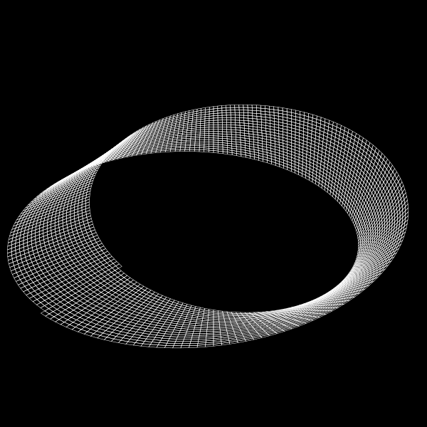
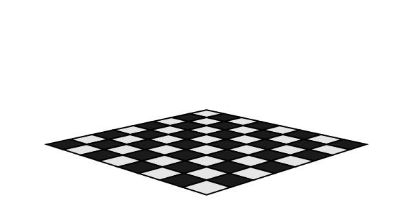
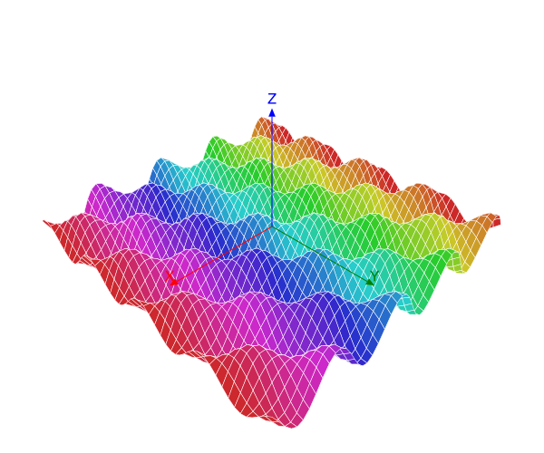

```@meta
DocTestSetup = quote
    using Thebes, Luxor, Colors, Rotations
    end
```

# Polygons and planes

The `pin()` function accepts an array of 3D points as well as singletons and pairs. In this case, the default graphical treatment is to apply the `Luxor.poly(... :stroke)` function to the array of projected 2D points.

## Möbius

```@example
using Thebes, Luxor # hide

function makemobius()
    x(u, v) = (1 + (v/2 * cos(u/2))) * cos(u)
    y(u, v) = (1 + (v/2 * cos(u/2))) * sin(u)
    z(u, v) = v/2 * sin(u/2)
    w = .5
    st = 2π/200
    Δ = .05
    result = Array{Point3D, 1}[]
    for u in 0:st:2π-st
        for v in -w:Δ:w
            p1 = Point3D(x(u,      v + Δ),   y(u,      v + Δ),     z(u,       v + Δ))
            p2 = Point3D(x(u + st, v + Δ),   y(u + st, v + Δ),     z(u  + st, v + Δ))
            p3 = Point3D(x(u + st, v),       y(u + st, v),         z(u + st,  v))
            p4 = Point3D(x(u,      v),       y(u,      v),         z(u,       v))
            push!(result, [p1, p2, p3, p4])
        end
    end
    return result # as an array of 3D polygons
end

# ... in a drawing
Drawing(600, 600, "assets/figures/mobiusband.svg") # hide
origin() # hide
background("black")
setline(0.5) # hide
eyepoint(300, 300, 300)
perspective(1200)
mb = makemobius()
setopacity(1)
sethue("white")
for pgon in mb
    pin(100pgon)
end
finish() # hide
nothing # hide
```



This isn't always going to work perfectly - if the 3D points don't lie in a plane, for example, or if you decide to use `fill` rather than `stroke` actions.

## Chessboard

You can probably risk 2D-filling a set of projected 3D points if they lie in the same 3D plane.

Here's a simple example. The gfunction here:

```
pin(plist,
    gfunction = (p3, p2) -> begin
        poly(p2, close=true, :fillpreserve)
        sethue("black")
        strokepath()
    end)
```

fills the polygon with the current colour, then outlines it in black.

```@example
using Thebes, Luxor # hide
Drawing(600, 300, "assets/figures/chessboard.svg") # hide
background("white") # hide
origin() # hide
sethue("blue") # hide
helloworld() # hide

perspective(1200)
eyepoint(500, 500, 150)
k = 20
w, h = 20, 20
for x in 1:8
    for y in 1:8
        iseven(x + y) ? sethue("grey90") : sethue("grey10")
        z = 0
        plist = [
            Point3D(k * x,     k * y,      z),
            Point3D(k * x + w, k * y,      z),
            Point3D(k * x + w, k * y + h,  z),
            Point3D(k * x,     k * y + h,  z)
            ]
        pts = pin(plist, gfunction = (_, p2) -> begin
                poly(p2, close=true, :fillpreserve)
                sethue("black")
                strokepath()
            end)
    end
end

finish() # hide
nothing # hide
```



Each square is constructed in a `plist` and then `pin()` applies its custom gfunction to it.

## Surfaces

A surface plot like the following also works quite well, mainly because each new polygon hides the ones behind it.

```@example
using Thebes, Luxor, Colors # hide
Drawing(600, 500, "assets/figures/surfaceplot.svg") # hide
background("white") # hide
origin() # hide
sethue("blue") # hide
helloworld() # hide

perspective(600)
eyepoint(500, 500, 500)

k = 20
xmax = 4π
ymax = 4π
st = 0.5

f(x, y) = 2(sin(x) * cos(y)) + (cos(x) * sin(y))

setline(.5)

for x in -xmax:st:xmax
    for y in -ymax:st:ymax
        sethue(HSB(360rescale(x, -xmax, xmax), .8, .8))

        p1 = Point3D(k * x,         k * y,        k * f(x,      y))
        p2 = Point3D(k * x,         k * (y + st), k * f(x,      y +st))
        p3 = Point3D(k * (x + st),  k * (y + st), k * f(x + st, y + st))
        p4 = Point3D(k * (x + st),  k * y,        k * f(x + st, y))
        pin([p1, p2, p3, p4], gfunction = (p3s, p2s) -> begin
            poly(p2s, close=true, :fill)
            sethue("white")
            poly(p2s, close=true, :stroke)
        end)
    end
end

axes3D(200)

finish() # hide
nothing # hide
```



!!! note

    Don't forget to check out Makie.jl for genuine 3D plotting...
