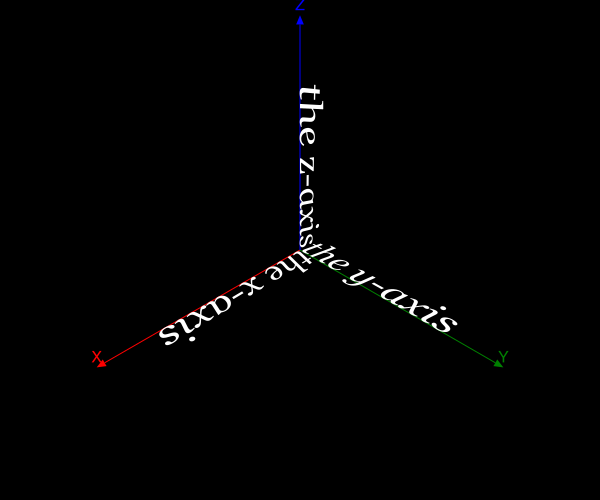
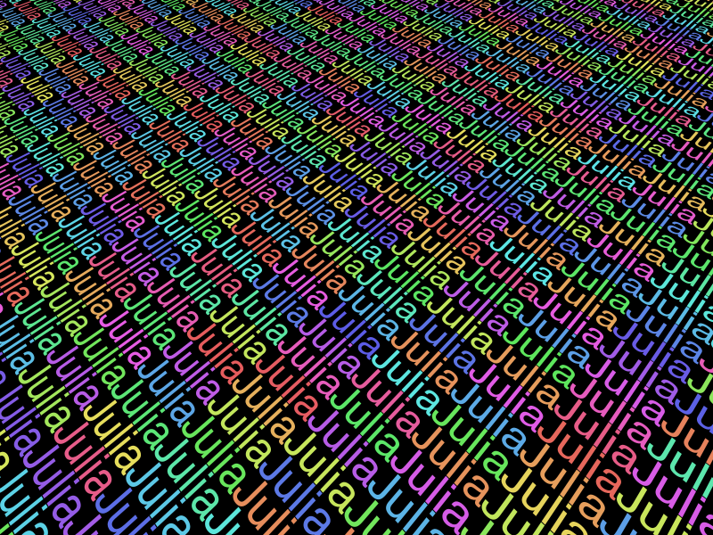

```@meta
DocTestSetup = quote
    using Thebes, Luxor, Colors
    end
```

# Text

Thebes provides a `text3D()` function that draws text in a 3D environment. For more information about using fonts and font selection, refer to the chapter in the Luxor documentation.

You specify the 3D location of the text, and optionally supply rotation (a tuple of three angles for x, y, and z) and text alignment (`halign` etc.). By default the text in Thebes (as in Luxor) runs along the x-axis, and it lies in the xy plane.

```@example
using Thebes, Luxor # hide
Drawing(600, 500, "assets/figures/text1.svg") # hide

fontsize(50)

background("black")
origin()
setlinejoin("bevel")
eyepoint(Point3D(250, 250, 250))
perspective(400)
sethue("white")
axes3D(220)

fontsize(40)
fontface("Georgia-Italic")

text3D("the x-axis", Point3D(50, 0, 0))
text3D("the y-axis", Point3D(0, 50, 0), rotation=(0, 0, π/2))
text3D("the z-axis", Point3D(0, 0, 0), rotation=(0, π/2, 0), halign=:right)

finish() # hide
nothing # hide
```



You can also use some of Luxor's text functions, such as `textextents()`, which helps you get the (2D) dimensions of text.

```@example
using Thebes, Luxor, Colors # hide
Drawing(600, 500, "assets/figures/text2.svg") # hide
background("black") # hide
origin() # hide
eyepoint(Point3D(250, 250, 550))
perspective(500)

fontsize(50)

te = textextents("Julia")

for y in -1200:te[3]:1200
    for x in -1200:te[4]:1200
            sethue(HSB(mod(x*y, 360), .8, .8))
            text3D("Julia", Point3D(x, y, 0), rotation=(0, 0, π/2))
    end
end
finish() # hide
nothing # hide
```



```@docs
text3D
```
