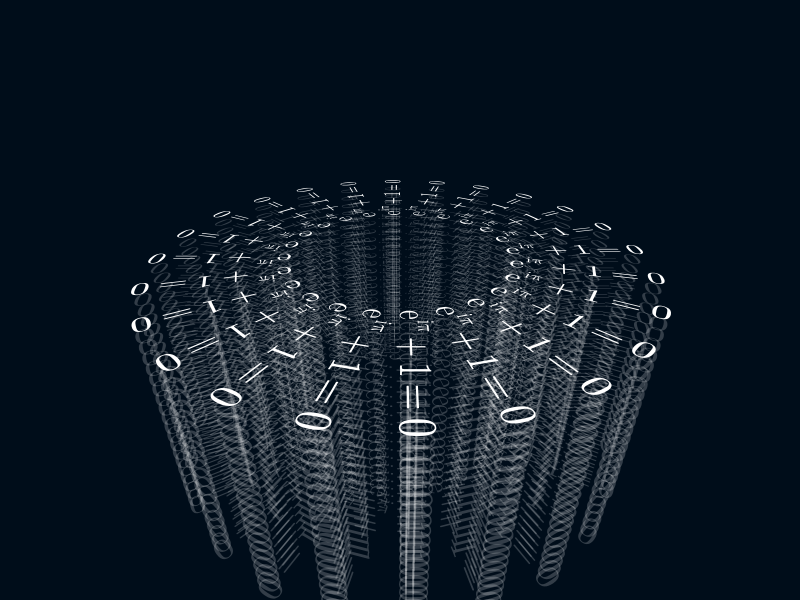

```@meta
DocTestSetup = quote
    using Thebes, Luxor, Colors, Rotations
    end
```

# Text

Thebes provides a `text3D()` function that draws text on a 2D plane in 3D space. 

!!! note
    
    For more information about using fonts and font selection, refer to the "Text" chapter in the Luxor documentation.

You specify the 3D location of the text's 'anchor' point, and optionally supply rotations and text alignment (`halign` etc.). By default, the text in Thebes (as in Luxor) runs along the x-axis, and lies in the xy plane.

Use Rotations.jl to specify rotations.

```@example
using Thebes, Luxor, Rotations # hide

@drawsvg begin
fontsize(50)
background("grey20")
setlinejoin("bevel")
eyepoint(Point3D(250, 250, 250))
perspective(400)
sethue("white")
axes3D(220)

fontsize(40)
fontface("Georgia-Italic")

text3D("the x-axis", Point3D(0, 0, 0))
text3D("the y-axis", Point3D(0, 0, 0), 
    rotation=RotZ(deg2rad(90)))
text3D("the z-axis", Point3D(0, 0, 0), 
    rotation=RotX(-deg2rad(90)) * RotZ(deg2rad(90)), halign=:right)

end 800 600
```

The three main differences between `Luxor.text()` and `Thebes.text3D()` are the anchor position (a Point3D), the `about` keyword, and the `rotation` keyword. You can see above that the `the y-axis` text has been rotated around the Z axis by 90°. The `the z-axis` text is aligned right, so the first rotation - in the z-axis - sends the text to be aligned with the y-axis, such that the 's' is almost touching the origin. Then the 90° clockwise rotation about the x-axis lifts the text up to run along the z-axis. In the construction `RotX(...) * RotZ(...)`, the z-axis rotation is applied first.

You can also use some of Luxor's text functions, such as `textextents()`, which helps you get the (2D) dimensions of text.

```@example
using Thebes, Luxor, Colors, Rotations
background("grey20") # hide
@drawsvg begin
eyepoint(Point3D(250, 250, 550))
perspective(500)
fontsize(50)
te = textextents("Julia")

for y in -1200:te[3]:1200
        for x in -1200:te[4]:1200
            sethue(HSB(mod(x*y, 360), .6, .9))
            text3D("Julia", Point3D(x, y, 0), about=Point3D(x, y, 0), rotation=RotZ(π/2))
        end
    end

end 800 800
```

It's also possible to write math equations in ``\LaTeX`` by
passing a `LaTeXString` to the `text` function. Thebes and
Luxor use
[MathTeXEngine.jl](https://github.com/Kolaru/MathTeXEngine.jl)
to parse the `LaTeXString`. You should load MathTeXEngine.jl
(`using MathTeXEngine`) before accessing this feature.

```julia
using Luxor
using Thebes
using MathTeXEngine
using Rotations
using LaTeXStrings

@svg begin
    background(0.0, 0.05, 0.1)
    helloworld()
    perspective(500)
    eyepoint(300, 300, 250)
    sethue("white")
    fontsize(30)
    setline(1)
    for z in -150:10:50
        setopacity(z < 50 ? 0.2 : 1)
        e = L"e^{i\pi} + 1 = 0"
        for i in 0:π/12:2π-π/12
            text3D(e,
                sphericaltocartesian(100, i, π / 2) + Point3D(0, 0, z),
                about=sphericaltocartesian(100, i, π / 2),
                rotation= RotZ(i))
        end
    end
end 800 600 "/tmp/text3.svg"
```



```@docs
text3D
```
