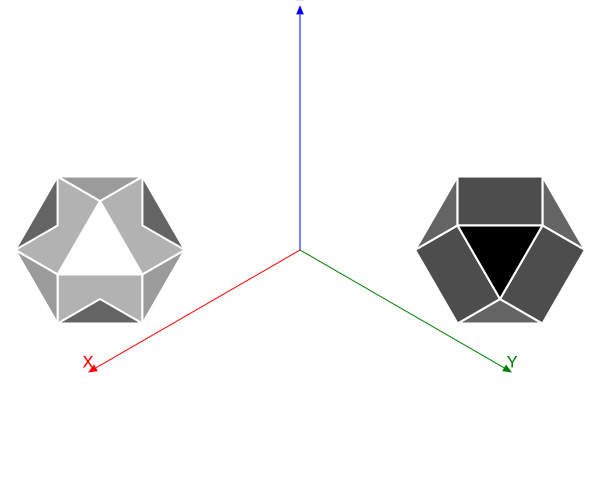

```@meta
DocTestSetup = quote
    using Thebes, Luxor, Colors
    end
```

# Tools

There are few useful tools that might help you explore.

## Getting your hands dirty

Because Thebes isn't really for modelling solid objects, so you might have to dig a bit deeper to get the results you want.

For example, suppose you want to remove the front-facing faces of an object, in order to see inside. That's possible, but a bit of code is needed.

```@example
using Thebes, Luxor, Colors # hide
Drawing(600, 500, "assets/figures/cullingfaces.svg") # hide
background("white") # hide
origin() # hide
helloworld() # hide
eyepoint(200, 200, 200)
axes3D(300)
setlinejoin("bevel")

include(dirname(pathof(Thebes)) * "/../data/moreobjects.jl")

objectfull = make(cuboctahedron, "solid")
objectcut  = make(cuboctahedron, "solid")

map(o -> setscale!(o, 60, 60, 60), (objectfull, objectcut))

function cullfrontfaces!(m::Object, angle;
        eyepoint::Point3D=eyepoint())
    avgs = Float64[]
    for f in m.faces
        vs = m.vertices[f]
        s = 0.0
        for v in vs
            s += distance(v, eyepoint)
        end
        avg = s/length(unique(vs))

        θ = surfacenormal(vs)
        if anglebetweenvectors(θ, eyepoint) > angle
            push!(avgs, avg)
        end
    end
    neworder = reverse(sortperm(avgs))
    m.faces = m.faces[neworder]
    m.labels = m.labels[neworder]
    return m
end

function drawobject(object)
    pin(object, gfunction = (args...) -> begin
    vertices, faces, labels = args
    setopacity(0.8)
    sethue("grey80")
    if !isempty(faces)
        @layer begin
            for (n, p) in enumerate(faces)
                poly(p, :fillpreserve, close=true)
                @layer begin
                    sethue("grey20")
                    strokepath()
                end
            end
        end
    end
end)
end

sortfaces!.((objectcut, objectfull))
cullfrontfaces!(objectcut, π/3)

translate(-200, 0)
drawobject(objectcut)

translate(400, 0)
drawobject(objectfull)

finish() # hide
nothing # hide
```



# Geometry

There are some geometry routines - some of them are extensions to the Luxor 2D versions.

## Distances

```@docs
between
distance
midpoint
```

## Rotations


```@docs
rotateX
rotateY
rotateZ
rotateby!
rotateby
```

## Position and scale

You can change the position or position of objects:

```@docs
setposition!
setposition
setscale!
```

## Coordinates

Here are some of the less frequently used functions.

```@docs
sphericaltocartesian
cartesiantospherical

dotproduct3D
magnitude
anglebetweenvectors
surfacenormal
```
