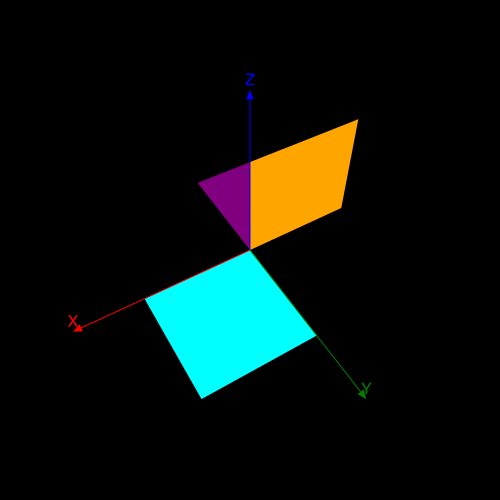
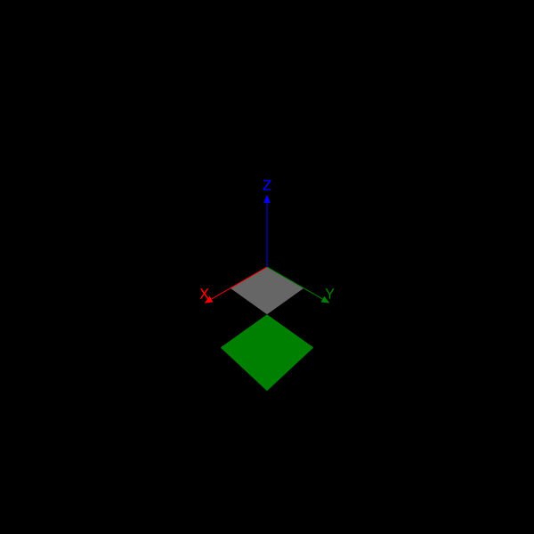
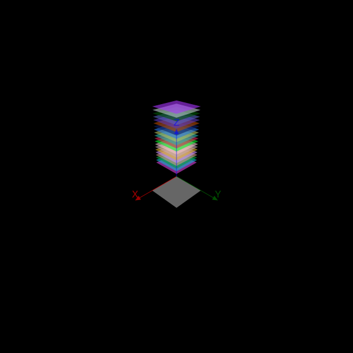
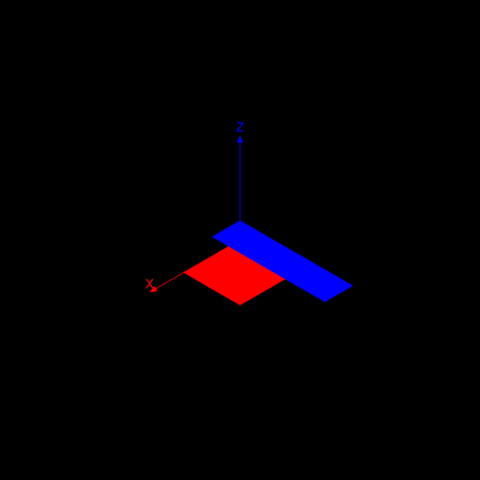

```@meta
DocTestSetup = quote
    using Thebes, Luxor, Colors, Rotations
    end
```

# Tools

There are some useful tools that might help you explore the limited 3D world provided by Thebes.jl.

## Getting your hands dirty

Suppose you want to remove the front-facing faces of an object, in order to see inside. That's possible, but a bit of code is needed.

```@example
using Thebes, Luxor, Colors # hide
Drawing(600, 500, "assets/figures/cullingfaces.svg") # hide
background("white") # hide
origin() # hide
helloworld() # hide
eyepoint(200, 200, 200)
axes3D(300)
setlinejoin("bevel")

include(dirname(pathof(Thebes)) * "/../data/moreobjects.jl")

objectfull = make(cuboctahedron, "the full object")
objectcut  = make(cuboctahedron, "the cut-open object")

map(o -> scaleby!(o, 60, 60, 60), (objectfull, objectcut))

function cullfrontfaces!(m::Object, angle;
        eyepoint::Point3D=eyepoint())
    avgs = Float64[]
    for f in m.faces
        vs = m.vertices[f]
        s = 0.0
        for v in vs
            s += distance(v, eyepoint)
        end
        avg = s/length(unique(vs))

        θ = surfacenormal(vs)
        if anglebetweenvectors(θ, eyepoint) > angle
            push!(avgs, avg)
        end
    end
    neworder = reverse(sortperm(avgs))
    m.faces = m.faces[neworder]
    m.labels = m.labels[neworder]
    return m
end

function drawobject(object)
    pin(object, gfunction = (args...) -> begin
        vertices, faces, labels = args
        setopacity(0.8)
        sethue("grey80")
        if !isempty(faces)
            @layer begin
                for (n, p) in enumerate(faces)
                    poly(p, :fillpreserve, close=true)
                    @layer begin
                        sethue("grey20")
                        strokepath()
                    end
                end
            end
        end
    end)
end

sortfaces!.((objectcut, objectfull))
cullfrontfaces!(objectcut, π/3)

translate(-200, 0)
drawobject(objectcut)

translate(400, 0)
drawobject(objectfull)

@show length(objectcut.faces)
@show length(objectfull.faces)

finish() # hide
nothing # hide
```

The object on the left has had its four frontfacing faces removed. The one on the right is intact.


# Geometry

There are some basic geometry utility functions - some of them are analogous to their Luxor 2D counterparts.

## General

```@docs
axes3D
carpet
drawcube
```

## Distances

```@docs
between
distance
midpoint
```

## Rotations

The task of rotating points in 3D space is given to Rotations.jl, a powerful and sophisticated package that offers many advanced functions for rotating things in 3D space. For Thebes, you'll probably only need the basics, but there's things like quaternions if you want to get fancy.

This code draws a cyan square lying in the XY plane with a corner at the 3D origin. The square is then rotated about the Z axis by 180° and drawn in purple. Then the square is rotated again, about the X axis, by 90° and drawn in orange.

```@example
using Luxor, Thebes, Rotations # hide

Drawing(500, 500, "assets/figures/basic-rotations.svg") # hide
background("black") # hide
origin() # hide
setlinejoin("bevel") # hide

eyepoint(Point3D(150, 250, 350))
perspective(520)

function drawsquare(ptlist)
    pin(ptlist, gfunction = (p3, p2) ->
        poly(p2, :fill, close=true))
end

square = [Point3D(0, 0, 0), Point3D(100, 0, 0), Point3D(100, 100, 0), Point3D(0, 100, 0)]

sethue("cyan")
drawsquare(square)

sethue("purple")
rotateby!(square, RotZ(π))
drawsquare(square)

sethue("orange")
rotateby!(square, RotX(-π/2))
drawsquare(square)

axes3D(160)

finish() # hide
nothing # hide
```



The most useful rotation functions are `RotX()`, `RotY()`, `RotZ()`, `RotXY()`, and `RotXYZ()`, which rotate around the axes. All the other permutations are available. A `RotXYZ()` rotation takes three angles. The right-most rotation is applied first, so `RotXYZ()` applies the Z rotation, followed by the Y, then followed by the X.

You can compose two or more rotations by multiplying them together, eg `RotX(π/2) * RotZ(π/4)`.

The rotation functions without `!` return new points or arrays of points.

There are also functions that accept a second 3D point, the `about` point. The rotation  is applied around that point, rather than an axis. In the next example, the square is rotated in Z about the corner point at Point3D(100, 100, 0) and drawn in green.

```@example
using Luxor, Thebes, Rotations # hide

Drawing(600, 600, "assets/figures/basic-rotations-about.svg") # hide
background("black") # hide
origin() # hide
setlinejoin("bevel") # hide

eyepoint(Point3D(350, 350, 350)) # hide
perspective(320) # hide

function drawsquare(ptlist) # hide
    pin(ptlist, gfunction = (p3, p2) -> # hide
        poly(p2, :fill, close=true)) # hide
end # hide

square = [Point3D(0, 0, 0), Point3D(100, 0, 0), Point3D(100, 100, 0), Point3D(0, 100, 0)] # hide

sethue("grey40")
drawsquare(square)

sethue("green")
rotateby!(square, Point3D(100, 100, 0), RotZ(π))
drawsquare(square)

axes3D(160)
finish() # hide
nothing #hide
```



- `rotateby(point::Point3D, r::Rotation)`
- `rotateby(point::Point3D, about::Point3D, r::Rotation)`
- `rotateby(ptlist::Array{Point3D, 1}, r::Rotation)`
- `rotateby(ptlist::Array{Point3D, 1}, about::Point3D, r::Rotation)`

- `rotateby(ptlist::Array{Point3D, 1}, angleX, angleY, angleZ)`
- `rotateby(pt::Point3D, angleX, angleY, angleZ)`
- `rotateby(point::Point3D, about::Point3D, angleX, angleY, angleZ)`

- `rotateby(m::Object, angleX, angleY, angleZ)`
- `rotateby(m::Object, pt::Point3D, angleX, angleY, angleZ)`

Those with `!` mutate the array of points in place. (You can't modify a single point.)

- `rotateby!(ptlist::Vector{Point3D}, r::RotXYZ{Float64})`
- `rotateby!(ptlist::Array{Point3D, 1}, angleX, angleY, angleZ)`
- `rotateby!(ptlist::Array{Point3D, 1}, existingpt::Point3D, angleX, angleY, angleZ)`
- `rotateby!(ptlist::Array{Point3D, 1}, existingpt::Point3D, r::Rotation)`

- `rotateby!(m::Object, angleX, angleY, angleZ)`
- `rotateby!(m::Object, pt::Point3D, angleX, angleY, angleZ)`

```@docs
rotateX
rotateY
rotateZ
rotateby!
rotateby
```

## Position and scale

You can change the position and scale of things. `moveby()` makes a copy, `moveby!()` moves the original.

In the next example, the square is first moved by `-100/-100/0`, then copies are moved upwards by the loop index `i`.

```@example
using Luxor, Thebes # hide

Drawing(600, 600, "assets/figures/basic-moves.svg") # hide
background("black") # hide
origin() # hide
setlinejoin("bevel") # hide

eyepoint(Point3D(350, 350, 350)) # hide
perspective(320) # hide

function drawsquare(ptlist) # hide
    pin(ptlist, gfunction = (p3, p2) -> # hide
        poly(p2, :fill, close=true)) # hide
end # hide

square = [Point3D(0, 0, 0), Point3D(100, 0, 0), Point3D(100, 100, 0), Point3D(0, 100, 0)] # hide

sethue("grey40")
drawsquare(square)

moveby!(square, Point3D(-100, -100, 0))

setopacity(.6)
for i in 10:10:200
    randomhue()
    drawsquare(moveby.(square, Point3D(0, 0, i)))
end

axes3D(160)

finish() # hide
nothing #hide
```



`scaleby!()` changes the scale of a list of points.

```@example
using Luxor, Thebes # hide

Drawing(600, 600, "assets/figures/basic-scale.svg") # hide
background("black") # hide
origin() # hide
setlinejoin("bevel") # hide

helloworld() # hide

function drawsquare(ptlist) # hide
    pin(ptlist, gfunction = (p3, p2) -> # hide
        poly(p2, :fill, close=true)) # hide
end # hide

axes3D(160)

square = [Point3D(0, 0, 0), Point3D(100, 0, 0), Point3D(100, 100, 0), Point3D(0, 100, 0)] # hide

sethue("red")
drawsquare(square)

sethue("blue")
scaleby!(square, .5, 2, 1)
moveby!(square, Point3D(0, 0, 30))
drawsquare(square)

finish() # hide
nothing #hide
```



```@docs
moveby!
moveby
scaleby!
```

## Coordinates

```@docs
sphericaltocartesian
cartesiantospherical

dotproduct3D
crossproduct3D
magnitude
anglebetweenvectors
surfacenormal
pointsperpendicular
```
