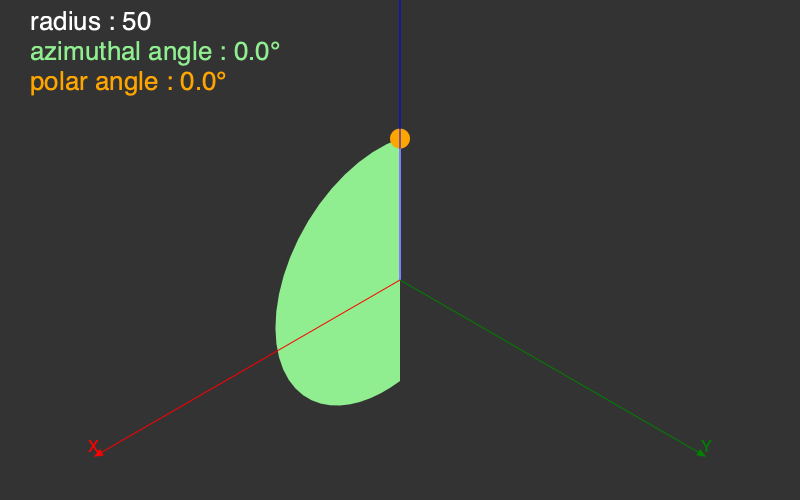

```@meta
DocTestSetup = quote
    using Thebes, Luxor, Colors, Rotations
    end
```

# Tools

There are some useful tools that might help you explore the limited 3D world provided by Thebes.jl.

## General

```@docs
axes3D
carpet
drawcube
```

```@example
using Thebes, Luxor # hide
@drawsvg begin
background("grey20")
helloworld()
sethue("grey40")
carpet(400)
drawcube(150)
axes3D()
end 800 400
```

There are some basic geometry utility functions - some of them are analogous to their Luxor 2D counterparts.

## Distances

```@docs
between
distance
midpoint
```

## Rotations

The task of rotating points in 3D space is given to Rotations.jl, a powerful and sophisticated package that offers many advanced functions for rotating things in 3D space. For Thebes, you'll probably only need the basics, but there's things like quaternions if you want to get fancy.

This code draws a cyan square lying in the XY plane with a corner at the 3D origin. The square is then rotated about the Z axis by 180° and drawn in purple. Then the square is rotated again, about the X axis, by 90° and drawn in orange.

```@example
using Luxor, Thebes, Rotations # hide

@drawsvg begin
background("grey20") # hide
setlinejoin("bevel") # hide

eyepoint(Point3D(150, 250, 350))
perspective(520)

function drawsquare(ptlist)
    pin(ptlist, gfunction = (p3, p2) ->
        poly(p2, :fill, close=true))
end

square = [
    Point3D(0, 0, 0), 
    Point3D(100, 0, 0), 
    Point3D(100, 100, 0), 
    Point3D(0, 100, 0)
    ]

sethue("cyan")
drawsquare(square)

sethue("purple")
rotateby!(square, RotZ(π))
drawsquare(square)

sethue("orange")
rotateby!(square, RotX(-π/2))
drawsquare(square)

axes3D(160)

end 800 400
```

The most useful rotation functions are `RotX()`, `RotY()`, `RotZ()`, `RotXY()`, and `RotXYZ()`, which rotate around the axes. All the other permutations are available. A `RotXYZ()` rotation takes three angles. The right-most rotation is applied first, so `RotXYZ()` applies the Z rotation, followed by the Y, then followed by the X.

You can compose two or more rotations by multiplying them together, eg `RotX(π/2) * RotZ(π/4)`.

The rotation functions without `!` return new points or arrays of points.

There are also functions that accept a second 3D point, the `about` point. The rotation  is applied around that point, rather than an axis. In the next example, the square is rotated in Z about the corner point at Point3D(100, 100, 0) and drawn in green.

```@example
using Luxor, Thebes, Rotations # hide

@drawsvg begin
    background("grey20")
    setlinejoin("bevel")

    eyepoint(Point3D(350, 350, 350))
    perspective(400)

    function drawsquare(ptlist)
        pin(ptlist, gfunction=(p3, p2) ->
            poly(p2, :fill, close=true))
    end

    square = [
        Point3D(0, 0, 0),
        Point3D(100, 0, 0),
        Point3D(100, 100, 0),
        Point3D(0, 100, 0)
    ]

    sethue("grey40")
    drawsquare(square)

    sethue("green")
    rotateby!(square, Point3D(100, 100, 0), RotZ(π))
    drawsquare(square)

    axes3D(160)
end 800 400
```

- `rotateby(point::Point3D, r::Rotation)`
- `rotateby(point::Point3D, about::Point3D, r::Rotation)`
- `rotateby(ptlist::Array{Point3D, 1}, r::Rotation)`
- `rotateby(ptlist::Array{Point3D, 1}, about::Point3D, r::Rotation)`

- `rotateby(ptlist::Array{Point3D, 1}, angleX, angleY, angleZ)`
- `rotateby(pt::Point3D, angleX, angleY, angleZ)`
- `rotateby(point::Point3D, about::Point3D, angleX, angleY, angleZ)`

- `rotateby(m::Object, angleX, angleY, angleZ)`
- `rotateby(m::Object, pt::Point3D, angleX, angleY, angleZ)`

Those with `!` mutate the array of points in place. (You can't modify a single point.)

- `rotateby!(ptlist::Vector{Point3D}, r::RotXYZ{Float64})`
- `rotateby!(ptlist::Array{Point3D, 1}, angleX, angleY, angleZ)`
- `rotateby!(ptlist::Array{Point3D, 1}, existingpt::Point3D, angleX, angleY, angleZ)`
- `rotateby!(ptlist::Array{Point3D, 1}, existingpt::Point3D, r::Rotation)`

- `rotateby!(m::Object, angleX, angleY, angleZ)`
- `rotateby!(m::Object, pt::Point3D, angleX, angleY, angleZ)`

```@docs
rotateX
rotateY
rotateZ
rotateby!
rotateby
```

## Position and scale

You can change the position and scale of things. `moveby()` makes a copy, `moveby!()` moves the original.

In the next example, the square is first moved by `-100/-100/0`, then copies are moved upwards by the loop index `i`.

```@example
using Luxor, Thebes # hide

@drawsvg begin
    background("grey20")
    setlinejoin("bevel")

    eyepoint(Point3D(400, 400, 500))
    perspective(600)

    function drawsquare(ptlist)
        pin(ptlist, gfunction=(p3, p2) ->
            poly(p2, :fill, close=true))
    end

    square = [
        Point3D(0, 0, 0),
        Point3D(100, 0, 0),
        Point3D(100, 100, 0),
        Point3D(0, 100, 0)
    ]

    sethue("grey40")
    drawsquare(square)

    moveby!(square, Point3D(-100, -100, 0))

    setopacity(0.6)
    for i in 10:10:200
        randomhue()
        drawsquare(moveby.(square, Point3D(0, 0, i)))
    end

    axes3D(200)
end 800 400
```

`scaleby!()` changes the scale of a list of points.

```@example
using Luxor, Thebes # hide

@drawsvg begin
    background("grey20")
    setlinejoin("bevel")

    helloworld()

    function drawsquare(ptlist)
        pin(ptlist, gfunction=(p3, p2) ->
            poly(p2, :fill, close=true))
    end

    axes3D(160)

    square = [
        Point3D(0, 0, 0),
        Point3D(100, 0, 0),
        Point3D(100, 100, 0),
        Point3D(0, 100, 0)
    ]

    sethue("red")
    drawsquare(square)

    sethue("blue")
    scaleby!(square, 0.5, 2, 1)
    moveby!(square, Point3D(0, 0, 30))
    drawsquare(square)
end 800 350
```

```@docs
moveby!
moveby
scaleby!
```

## Coordinates

A useful function is `sphericaltocartesian()`. This takes three values using spherical coordinates - radius, azimuthal angle, polar angle - and converts them to Cartesian coordinates - x, y, and z.

The `sphericaltocartesian()` function accepts three arguments: `(ρ, θ, φ)` - a radius, azimuthal angle, and a polar angle, in that order, and converts it to a 3D point in Cartesian coordinates.

!!! note
    
    One way to find out whether someone is a mathematician or a physicist is to ask them the order and meaning of the arguments `(ρ, θ, φ)` in a `sphericaltocartesian()` function. If `ρ` is the radius, is `θ` the azimuthal angle or the polar angle, and is `φ` the polar angle or the azimuthal angle? We're using the mathematicians’ order, apparently.

This animation shows the green semicircle changing its azimuthal angle from 0° through 360° while the the orange dot changes its polar angle from 0° to 180°.



```@docs
sphericaltocartesian
cartesiantospherical

dotproduct3D
crossproduct3D
magnitude
anglebetweenvectors
surfacenormal
pointsperpendicular
```
