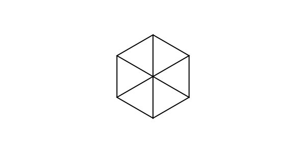
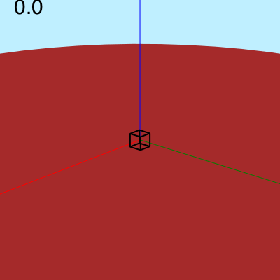
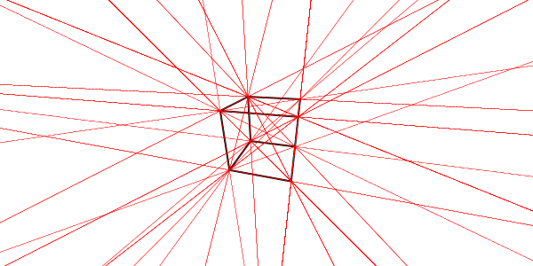

```@meta
DocTestSetup = quote
    using Thebes, Luxor, Colors
    end
```

# Views and perspective

## Eyepoint, centerpoint...

Thebes takes a simple view of life. There's a global "world", which is created when you start using it. It's a good idea to check and/or set the viewing parameters when you start a new Luxor document, in case you're inheriting anything odd from a previous run.

Here are the functions that control your view of the 3D scene:

- `helloworld()`  
- `eyepoint()`  
- `centerpoint()`
- `perspective()`

The first one is a useful one to remember: it simply resets all the viewing parameters to the defaults.

The `eyepoint()` function moves the `eyepoint`, and `centerpoint()` changes the location that is the center of your view. There's also an `uppoint()` function, usually sitting above `centerpoint`, which determines which way is up.

So, to see the side view of the helix, continued from the previous chapter, we can just lower our viewpoint a bit, from the default 100 in z down to 50:

```@example
using Thebes, Luxor # hide
Drawing(600, 200, "assets/figures/helix5.svg") # hide
background("white") # hide
origin() # hide
uppoint(0, 0, 100) # hide
centerpoint(0, 0, 50) # hide

helix = [Point3D(150cos(θ), 150sin(θ), 5θ) for θ in 0:π/48:4π]

setline(0.5)

eyepoint(500, 500, 50)

axes3D()

for p in helix
    pin(p, Point3D(0, 0, p.z))
end
finish()
nothing # hide
```


## Perspective

As yet we've seen no perspective. The defaut value of the perspective parameter, as returned by `perspective()`, is 0. This means that there's none of that foreshortening or converging of lines that head off into the distance. And if you look at a cube, it has that familiar unrealistic appearance of non-perspective view.

```@example
using Thebes, Luxor # hide

helloworld() # hide

function makecube()
    cube = [
        Point3D(1,   1, -1),
        Point3D(1,  -1, -1),
        Point3D(-1, -1, -1),
        Point3D(-1,  1, -1),
        Point3D(1,   1,  1),
        Point3D(1,  -1,  1),
        Point3D(-1, -1,  1),
        Point3D(-1,  1,  1)]
    r = Point3D[]

    for e in (
        [1, 2, 3, 4, 1],
        [5, 6, 7, 8, 5],
        [5, 1, 2, 6, 7],
        [7, 3, 4, 8, 5])
        append!(r, cube[e])        
    end
    return r
end

Drawing(600, 300, "assets/figures/cube1.svg") #hide
background("white") # hide
origin() # hide

pin(50makecube())

finish()
nothing # hide
```



This little animation views the cube and changes the perspective slowly from 0 up to 1400.



As the value of `perspective` increases, the apparent magnification increases, and parallel lines will start to converge.

```@example
using Thebes, Luxor # hide

helloworld() # hide

function makecube()
    cube = [
        Point3D(1,   1, -1),
        Point3D(1,  -1, -1),
        Point3D(-1, -1, -1),
        Point3D(-1,  1, -1),
        Point3D(1,   1,  1),
        Point3D(1,  -1,  1),
        Point3D(-1, -1,  1),
        Point3D(-1,  1,  1)]
    r = Point3D[]

    for e in (
        [1, 2, 3, 4, 1],
        [5, 6, 7, 8, 5],
        [5, 1, 2, 6, 7],
        [7, 3, 4, 8, 5])
        append!(r, cube[e])        
    end
    return r
end

Drawing(600, 300, "assets/figures/cube-in-perspective.svg") #hide
background("white") # hide
origin() # hide

eyepoint(200, 50, 100)
perspective(150)
pts = pin(50makecube())

sethue("red")
setline(0.1)
for p1 in pts
    for p2 in pts
        p1 == p2 && continue
        rule(p1, slope(p1, p2))
    end
end

finish() # hide
nothing # hide

```



And there are enough converging parallel lines there to give an ancient Egyptian architect nightmares.

## Orbits

To fly around the scene, you can just move the eyepoint around:

```
using Thebes, Luxor
function frame(scene, framenumber, object)
    background("skyblue")
    setlinejoin("bevel")

    setline(3.0)
    sethue("grey30")
    carpet(500)
    eased_n = rescale(scene.easingfunction(framenumber, 0, 1,
        scene.framerange.stop), 0, 1, 0, 2π)

    sethue("white")
    perspective(200)
    eyepoint(200cos(eased_n), 200sin(eased_n), 40)
    pts = pin(50object)

    sethue("orange")
    setline(0.5)
    for pair in ((1, 2), (2, 3), (3, 4), (4, 1))
        rule(pts[first(pair)], slope(pts[first(pair)], pts[last(pair)]))
    end

    axes3D()
end

function makecube()
    cube = [
        Point3D(1,   1, -1),
        Point3D(1,  -1, -1),
        Point3D(-1, -1, -1),
        Point3D(-1,  1, -1),
        Point3D(1,   1,  1),
        Point3D(1,  -1,  1),
        Point3D(-1, -1,  1),
        Point3D(-1,  1,  1)]
    r = Point3D[]

    for e in (
        [1, 2, 3, 4, 1],
        [5, 6, 7, 8, 5],
        [5, 1, 2, 6, 7],
        [7, 3, 4, 8, 5])
        append!(r, cube[e])        
    end
    return r
end


function main()
    w = 600
    h = 400
    movie1 = Movie(w, h, "3D movie")
    cube = makecube()
    d = animate(movie1,
            Scene(movie1, (s, f)  -> frame(s, f, cube),
                    1:150, easingfunction=easeinoutsine),
        creategif=true,
        framerate=20,
        pathname="/tmp/orbiting-a-cube.gif")
    return d
end

main()
```


