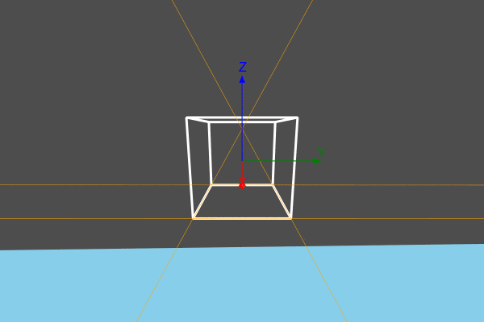

```@meta
DocTestSetup = quote
    using Thebes, Luxor, Colors, Rotations
    end
```

# Views and perspective

## Eyepoint and centerpoint
Thebes takes a simple view of life. There’s a global Thebes ‘realm’ which is created when you start `using` it. It’s a good idea to check and/or set the current viewing parameters when you start a new Luxor document, in case you’re inheriting anything from a previous run.

Here are the functions that control your view of the 3D scene:

- `helloworld()`  
- `eyepoint()`  
- `centerpoint()`
- `uppoint()`
- `perspective()`

The first one is a useful one to remember: it simply resets all the viewing parameters to the default settings.

The `eyepoint()` function moves the `eyepoint`, and `centerpoint()` changes the location that is the center of your view. The `uppoint()` function specifies a point relative to `centerpoint`. A line running from centerpoint to the up point defines the “up” direction.

So, to see the side view of the helix, continued from the previous chapter, we can just lower our viewpoint a bit, from the default 100 in z down to 50:

```@example
using Thebes, Luxor # hide
@drawsvg begin
background("grey20") # hide
origin() # hide
uppoint(0, 0, 100) # hide
centerpoint(0, 0, 50) # hide

helix = [Point3D(200cos(θ), 200sin(θ), 5θ) for θ in 0:π/48:4π]

setline(0.2)

eyepoint(500, 500, 50)

axes3D()
sethue("gold")
for p in helix
    pin(p, Point3D(0, 0, p.z))
end
end 800 400
```

## Perspective

As yet we've seen no perspective. The default value of the perspective parameter, as returned by `perspective()`, is 0. This means that there's none of that foreshortening or converging of lines that head off into the distance. And if you look at a cube, it has that familiar unrealistic appearance of cubes drawn without perspective. It doesn't matter if you move the eyepoint further away, either.

```@example
using Thebes, Luxor # hide

helloworld() # hide

function makecube()
    cube = [
        Point3D(1,   1, -1),
        Point3D(1,  -1, -1),
        Point3D(-1, -1, -1),
        Point3D(-1,  1, -1),
        Point3D(1,   1,  1),
        Point3D(1,  -1,  1),
        Point3D(-1, -1,  1),
        Point3D(-1,  1,  1)]
    r = Point3D[]

    for e in (
        [1, 2, 3, 4, 1],
        [5, 6, 7, 8, 5],
        [5, 1, 2, 6, 7],
        [7, 3, 4, 8, 5])
        append!(r, cube[e])        
    end
    return r
end

@drawsvg begin
background("grey20") # hide
origin() # hide
sethue("magenta")
pin(50makecube())

end 800 400
```

This animation views the cube and changes the perspective slowly, starting at 0, then moving from 300 up to 1400.


As the value of `perspective` increases, the apparent magnification increases, and parallel lines start to converge. The next example shows the converging parallel lines.

```@example
using Thebes, Luxor # hide

helloworld() # hide

function makecube()
    cube = [
        Point3D(1,   1, -1),
        Point3D(1,  -1, -1),
        Point3D(-1, -1, -1),
        Point3D(-1,  1, -1),
        Point3D(1,   1,  1),
        Point3D(1,  -1,  1),
        Point3D(-1, -1,  1),
        Point3D(-1,  1,  1)]
    r = Point3D[]

    for e in (
        [1, 2, 3, 4, 1],
        [5, 6, 7, 8, 5],
        [5, 1, 2, 6, 7],
        [7, 3, 4, 8, 5])
        append!(r, cube[e])        
    end
    return r
end

@drawsvg begin
background("grey20") # hide
origin() # hide

eyepoint(200, 50, 100)
perspective(150)
sethue("gold")
pts = pin(50makecube())

sethue("grey60")
setline(0.1)
for p1 in pts
    for p2 in pts
        p1 == p2 && continue
        rule(p1, slope(p1, p2))
    end
end
end 800 600
```

There are enough converging parallel lines there to give an ancient Egyptian architect nightmares.

What are the units of the number you provide to `perspective()`? I don't know - it's a vague magnification constant.

## Orbits

To fly around the scene, move the eyepoint around while looking at the center.

```julia
using Thebes, Luxor
function frame(scene, framenumber, object)
    background("skyblue")
    setlinejoin("bevel")

    setline(3.0)
    sethue("grey30")
    carpet(500)
    eased_n = rescale(scene.easingfunction(framenumber, 0, 1,
        scene.framerange.stop), 0, 1, 0, 2π)

    sethue("white")
    perspective(200)
    eyepoint(200cos(eased_n), 200sin(eased_n), 40)
    pts = pin(50object)

    sethue("orange")
    setline(0.5)
    for pair in ((1, 2), (2, 3), (3, 4), (4, 1))
        rule(pts[first(pair)], slope(pts[first(pair)], pts[last(pair)]))
    end

    axes3D()
end

function makecube()
    cube = [
        Point3D(1,   1, -1),
        Point3D(1,  -1, -1),
        Point3D(-1, -1, -1),
        Point3D(-1,  1, -1),
        Point3D(1,   1,  1),
        Point3D(1,  -1,  1),
        Point3D(-1, -1,  1),
        Point3D(-1,  1,  1)]
    r = Point3D[]

    for e in (
        [1, 2, 3, 4, 1],
        [5, 6, 7, 8, 5],
        [5, 1, 2, 6, 7],
        [7, 3, 4, 8, 5])
        append!(r, cube[e])        
    end
    return r
end

function main()
    w = 600
    h = 400
    movie1 = Movie(w, h, "3D movie")
    cube = makecube()
    d = animate(movie1,
            Scene(movie1, (s, f)  -> frame(s, f, cube),
                    1:150, easingfunction=easeinoutsine),
        creategif=true,
        framerate=20,
        pathname="/tmp/orbiting-a-cube.gif")
    return d
end

main()
```


